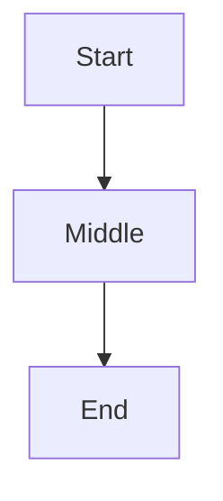

# Plan Explorer v1.1 Implementation Plan

> **For agentic workers:** REQUIRED SUB-SKILL: Use superpowers:subagent-driven-development (recommended) or superpowers:executing-plans to implement this plan task-by-task. Steps use checkbox (`- [ ]`) syntax for tracking.

**Goal:** Add four code/file-rendering enrichments to the v1.0 Plan Explorer: real syntax highlighting (Prism), interactive tree blocks, IDE deep-links, and unified diff rendering.

**Architecture:** All work happens client-side except one new server endpoint (`GET /resolve`) that returns absolute paths under the plan's directory for IDE-link wrapping. Prism.js is vendored locally; no new runtime dependencies for the user. Extends the existing `configureMarked()` plus `renderAll()` chain in `static/app.js`.

**Tech Stack:** Python 3 stdlib (server endpoint), vanilla JS (renderers), CSS Grid + variables (theming), Prism.js v1.29 (vendored), pytest + Playwright (tests).

**Spec:** `docs/superpowers/specs/2026-05-20-plan-explorer-v1.1-design.md`

---

## File Structure

```
~/.claude/skills/plan-explorer/
├── scripts/
│   └── server.py                  # MODIFY: add State.base_dir + /resolve route
├── static/
│   ├── index.html                 # MODIFY: load prism.min.js + prism.css
│   ├── app.js                     # MODIFY: extend configureMarked, add renderTreeBlock, renderDiffBlock, attachIdeLinks, resolvePath, runPrism
│   ├── styles.css                 # MODIFY: tree, diff, ide-link styles
│   └── vendor/
│       ├── prism.min.js           # CREATE: vendored Prism core + languages bundle
│       └── prism.css              # CREATE: theme tied to existing --surface/--text vars
└── tests/
    ├── test_server.py             # MODIFY: 2 new tests for /resolve
    ├── test_client.py             # MODIFY: 5 new tests (syntax/tree/diff/ide-link x2)
    └── fixtures/
        └── rich.md                # MODIFY: add tree + diff samples
```

Each modified file keeps its existing single responsibility. `app.js` continues to be the all-client module; the new renderers are pure helpers added near the existing `renderAll`/`configureMarked` chain.

---

## Task 1: Vendor Prism and enable token highlighting

**Files:**
- Create: `~/.claude/skills/plan-explorer/static/vendor/prism.min.js`
- Create: `~/.claude/skills/plan-explorer/static/vendor/prism.css`
- Modify: `~/.claude/skills/plan-explorer/static/index.html`
- Modify: `~/.claude/skills/plan-explorer/static/app.js`
- Modify: `~/.claude/skills/plan-explorer/tests/test_client.py`

- [ ] **Step 1: Failing test**

Append to `tests/test_client.py`:

```python
def test_syntax_highlight_python(page_loader):
    page, md = page_loader
    md.write_text("# P\n\n## A\n\n```python\ndef hi(): pass\n```\n")
    page.reload()
    page.wait_for_selector(".language-python .token.keyword")
```

- [ ] **Step 2: Run test, expect FAIL**

```bash
cd ~/.claude/skills/plan-explorer && .venv/bin/pytest tests/test_client.py::test_syntax_highlight_python -v
```

Expected: FAIL — no `.token.keyword` element yet.

- [ ] **Step 3: Vendor Prism with required languages**

```bash
curl -fsSL -o ~/.claude/skills/plan-explorer/static/vendor/prism.min.js \
  "https://cdn.jsdelivr.net/combine/npm/prismjs@1.29.0/prism.min.js,npm/prismjs@1.29.0/components/prism-python.min.js,npm/prismjs@1.29.0/components/prism-javascript.min.js,npm/prismjs@1.29.0/components/prism-typescript.min.js,npm/prismjs@1.29.0/components/prism-bash.min.js,npm/prismjs@1.29.0/components/prism-sql.min.js,npm/prismjs@1.29.0/components/prism-json.min.js,npm/prismjs@1.29.0/components/prism-yaml.min.js,npm/prismjs@1.29.0/components/prism-toml.min.js,npm/prismjs@1.29.0/components/prism-css.min.js,npm/prismjs@1.29.0/components/prism-markup.min.js,npm/prismjs@1.29.0/components/prism-rust.min.js,npm/prismjs@1.29.0/components/prism-go.min.js,npm/prismjs@1.29.0/components/prism-markdown.min.js"
test "$(wc -c < ~/.claude/skills/plan-explorer/static/vendor/prism.min.js)" -gt 50000 || { echo "prism too small"; exit 1; }
```

- [ ] **Step 4: Write `static/vendor/prism.css`** (theme tied to existing CSS variables)

```css
/* Prism theme — light + dark via body.dark scoping */
:root {
  --prism-bg: #1e1e2e;
  --prism-text: #cdd6f4;
  --prism-comment: #6c7086;
  --prism-keyword: #cba6f7;
  --prism-string: #a6e3a1;
  --prism-number: #fab387;
  --prism-function: #89b4fa;
  --prism-operator: #94e2d5;
  --prism-punctuation: #bac2de;
  --prism-builtin: #f9e2af;
  --prism-class: #f9e2af;
}
pre[class*="language-"] {
  background: var(--prism-bg);
  color: var(--prism-text);
}
pre[class*="language-"] code {
  font-family: inherit;
  color: inherit;
}
.token.comment, .token.prolog, .token.cdata { color: var(--prism-comment); font-style: italic; }
.token.keyword, .token.atrule, .token.attr-name, .token.selector { color: var(--prism-keyword); }
.token.string, .token.attr-value, .token.char, .token.regex { color: var(--prism-string); }
.token.number, .token.boolean { color: var(--prism-number); }
.token.function, .token.method { color: var(--prism-function); }
.token.operator, .token.entity, .token.url { color: var(--prism-operator); }
.token.punctuation { color: var(--prism-punctuation); }
.token.builtin, .token.tag { color: var(--prism-builtin); }
.token.class-name { color: var(--prism-class); }
.token.deleted { color: #f38ba8; }
.token.inserted { color: #a6e3a1; }
```

- [ ] **Step 5: Update `static/index.html` `<head>`**

Add these two lines after the existing `<link rel="stylesheet" href="/static/styles.css">`:

```html
  <link rel="stylesheet" href="/static/vendor/prism.css">
  <script src="/static/vendor/prism.min.js" defer></script>
```

The full `<head>` block becomes:

```html
<head>
  <meta charset="UTF-8">
  <title>Plan Explorer</title>
  <link rel="stylesheet" href="/static/styles.css">
  <link rel="stylesheet" href="/static/vendor/prism.css">
  <script src="/static/vendor/marked.min.js" defer></script>
  <script src="/static/vendor/prism.min.js" defer></script>
  <script src="/static/vendor/mermaid.min.js" defer></script>
  <script src="/static/app.js" defer type="module"></script>
</head>
```

- [ ] **Step 6: Add `runPrism()` helper in `static/app.js`**

Add this function next to the other render helpers:

```javascript
function runPrism() {
  if (!window.Prism) return;
  Prism.highlightAllUnder(document.getElementById("content"));
}
```

- [ ] **Step 7: Call `runPrism()` in `renderAll()`**

Inside the existing `renderAll(phases)` function, add `runPrism();` after the line that calls `wireCopyButtons();` (or as the last call before the optional mermaid block). The function body becomes:

```javascript
function renderAll(phases) {
  renderPhases(phases);
  renderSidebar(phases);
  renderProgressBar(phases);
  attachCheckboxes();
  attachCollapse();
  attachScrollSpy();
  attachPhaseEdit(phases);
  wireCopyButtons();
  attachAnchors();
  runPrism();
  if (window.mermaid) {
    mermaid.initialize({ startOnLoad: false, theme: document.body.classList.contains("dark") ? "dark" : "default" });
    mermaid.run({ querySelector: ".mermaid" });
  }
}
```

(Keep the order of the other calls as they already are in the file; only insert `runPrism();` in the position shown.)

- [ ] **Step 8: Run test, expect PASS**

```bash
cd ~/.claude/skills/plan-explorer && .venv/bin/pytest tests/test_client.py::test_syntax_highlight_python -v
```

Expected: 1 passed.

- [ ] **Step 9: Run full suite to confirm no regression**

```bash
cd ~/.claude/skills/plan-explorer && .venv/bin/pytest -q
```

Expected: 37 passed (36 prior + 1 new).

- [ ] **Step 10: Commit**

```bash
cd ~/.claude
git add skills/plan-explorer/static/vendor/prism.min.js \
        skills/plan-explorer/static/vendor/prism.css \
        skills/plan-explorer/static/index.html \
        skills/plan-explorer/static/app.js \
        skills/plan-explorer/tests/test_client.py
git commit -m "feat(plan-explorer): syntax highlight code blocks via vendored prism"
```

---

## Task 2: Tree blocks (`\`\`\`tree` fence → collapsible interactive tree)

**Files:**
- Modify: `~/.claude/skills/plan-explorer/static/app.js`
- Modify: `~/.claude/skills/plan-explorer/static/styles.css`
- Modify: `~/.claude/skills/plan-explorer/tests/test_client.py`

- [ ] **Step 1: Failing test**

Append to `tests/test_client.py`:

```python
def test_tree_block_collapsible(page_loader):
    page, md = page_loader
    md.write_text(
        "# P\n\n## A\n\n```tree\n"
        "root/\n├── a.py\n└── sub/\n    └── b.md\n"
        "```\n"
    )
    page.reload()
    page.wait_for_selector(".tree-dir")
    assert page.locator(".tree-dir").count() >= 2  # root/ and sub/
    assert page.locator(".tree-file").count() == 2  # a.py and b.md
    page.locator(".tree-dir .tree-toggle").nth(1).click()
    expanded = page.locator(".tree-dir").nth(1).get_attribute("aria-expanded")
    assert expanded == "false"
```

- [ ] **Step 2: Run, expect FAIL**

```bash
cd ~/.claude/skills/plan-explorer && .venv/bin/pytest tests/test_client.py::test_tree_block_collapsible -v
```

Expected: FAIL — no `.tree-dir` elements.

- [ ] **Step 3: Add `renderTreeBlock()` to `static/app.js`**

Add these constants and function (near `escapeHtml`):

```javascript
const TREE_ICONS = {
  py:"🐍", js:"📜", ts:"📘", json:"⚙️", yaml:"⚙️", yml:"⚙️", toml:"⚙️",
  md:"📝", html:"🌐", css:"🎨", sh:"🔧", rs:"🦀", go:"🦫",
  png:"🖼", jpg:"🖼", svg:"🖼",
};

function treeFileIcon(name) {
  const ext = name.split(".").pop().toLowerCase();
  return TREE_ICONS[ext] || "📄";
}

function parseTreeLines(raw) {
  // Returns an array of { depth, name, isDir }
  // Strips connector chars: ├ └ │ ─ and counts indent based on
  // the column where the leaf name starts.
  const out = [];
  const lines = raw.split("\n").filter(l => l.trim().length > 0);
  for (const line of lines) {
    // Strip everything up to and including the last connector run
    const match = line.match(/^([│\s]*)(?:[├└][─\s]+)?(.+)$/);
    if (!match) continue;
    const prefix = match[1];
    const name = match[2].trim();
    if (!name) continue;
    // Depth = number of `│   ` or 4-space columns in the prefix
    const depth = Math.floor(prefix.replace(/[│]/g, " ").length / 4);
    const isDir = name.endsWith("/");
    out.push({ depth, name: isDir ? name.slice(0, -1) : name, isDir });
  }
  return out;
}

function renderTreeBlock(raw) {
  const entries = parseTreeLines(raw);
  if (entries.length === 0) {
    return `<pre class="tree-warning">${escapeHtml(raw)}</pre>`;
  }
  // Build nested HTML by walking entries and tracking depth stack
  let html = '<ul class="tree" role="tree">';
  let lastDepth = -1;
  const openTags = [];
  for (const e of entries) {
    while (lastDepth >= e.depth) {
      html += openTags.pop() === "li" ? "</li>" : "</ul></li>";
      lastDepth--;
    }
    if (e.isDir) {
      html += `<li class="tree-dir" aria-expanded="true"><span class="tree-toggle"></span><span class="tree-name">${escapeHtml(e.name)}/</span><ul>`;
      openTags.push("li", "ul");
      lastDepth = e.depth;
      continue;
    }
    html += `<li class="tree-file" data-path="${escapeHtml(e.name)}"><span class="tree-icon">${treeFileIcon(e.name)}</span><span class="tree-name">${escapeHtml(e.name)}</span></li>`;
    lastDepth = e.depth;
  }
  while (openTags.length) {
    html += openTags.pop() === "li" ? "</li>" : "</ul></li>";
  }
  html += "</ul>";
  return html;
}

function attachTreeToggles() {
  document.querySelectorAll(".tree-dir > .tree-toggle").forEach(t => {
    t.addEventListener("click", (e) => {
      e.stopPropagation();
      const li = t.parentElement;
      li.setAttribute("aria-expanded", li.getAttribute("aria-expanded") === "true" ? "false" : "true");
    });
  });
}
```

- [ ] **Step 4: Hook `renderTreeBlock` into `configureMarked()` and call `attachTreeToggles()` in `renderAll`**

Inside the existing `configureMarked()` function, modify the `renderer.code` arrow function so the tree branch sits next to mermaid:

```javascript
  renderer.code = (code, lang) => {
    if (lang === "mermaid") {
      return `<div class="mermaid">${escapeHtml(code)}</div>`;
    }
    if (lang === "tree") {
      return renderTreeBlock(code);
    }
    const safe = escapeHtml(code);
    return `<pre><button class="copy-btn" data-code="${encodeURIComponent(code)}">copy</button><code class="language-${lang||'plain'}">${safe}</code></pre>`;
  };
```

In `renderAll()`, add `attachTreeToggles();` right after `wireCopyButtons();`:

```javascript
function renderAll(phases) {
  renderPhases(phases);
  renderSidebar(phases);
  renderProgressBar(phases);
  attachCheckboxes();
  attachCollapse();
  attachScrollSpy();
  attachPhaseEdit(phases);
  wireCopyButtons();
  attachTreeToggles();
  attachAnchors();
  runPrism();
  if (window.mermaid) {
    mermaid.initialize({ startOnLoad: false, theme: document.body.classList.contains("dark") ? "dark" : "default" });
    mermaid.run({ querySelector: ".mermaid" });
  }
}
```

- [ ] **Step 5: Append tree styles to `static/styles.css`**

```css
ul.tree, ul.tree ul {
  list-style: none;
  margin: 0; padding-left: 18px;
  font-family: "JetBrains Mono", Menlo, monospace;
  font-size: 13px;
  line-height: 1.7;
}
ul.tree { padding-left: 0; margin: 12px 0; }
ul.tree li { position: relative; }
.tree-dir > .tree-toggle {
  display: inline-block;
  width: 14px; text-align: center;
  cursor: pointer; color: var(--muted);
  user-select: none;
}
.tree-dir > .tree-toggle::before { content: "▾"; transition: transform .12s; display: inline-block; }
.tree-dir[aria-expanded="false"] > .tree-toggle::before { content: "▸"; }
.tree-dir[aria-expanded="false"] > ul { display: none; }
.tree-dir > .tree-name { color: var(--text); font-weight: 500; }
.tree-file { padding-left: 14px; cursor: default; }
.tree-file .tree-icon { display: inline-block; width: 18px; }
.tree-file:hover { background: var(--hover); border-radius: 4px; }
.tree-warning {
  background: #fef2f2; color: #991b1b;
  padding: 8px 12px; border-radius: 6px;
  font-family: "JetBrains Mono", Menlo, monospace;
  font-size: 12px;
}
body.dark .tree-warning { background: #1f0c0c; color: #fca5a5; }
```

- [ ] **Step 6: Run test, expect PASS**

```bash
cd ~/.claude/skills/plan-explorer && .venv/bin/pytest tests/test_client.py::test_tree_block_collapsible -v
```

Expected: 1 passed.

- [ ] **Step 7: Full suite green**

```bash
cd ~/.claude/skills/plan-explorer && .venv/bin/pytest -q
```

Expected: 38 passed.

- [ ] **Step 8: Commit**

```bash
cd ~/.claude
git add skills/plan-explorer/static/app.js \
        skills/plan-explorer/static/styles.css \
        skills/plan-explorer/tests/test_client.py
git commit -m "feat(plan-explorer): interactive collapsible tree blocks from ascii fence"
```

---

## Task 3: Diff blocks (`\`\`\`diff` fence → unified diff with line gutter)

**Files:**
- Modify: `~/.claude/skills/plan-explorer/static/app.js`
- Modify: `~/.claude/skills/plan-explorer/static/styles.css`
- Modify: `~/.claude/skills/plan-explorer/tests/test_client.py`

- [ ] **Step 1: Failing test**

```python
def test_diff_block_classifies_lines(page_loader):
    page, md = page_loader
    md.write_text(
        "# P\n\n## A\n\n```diff\n"
        "@@ -1,2 +1,2 @@\n"
        " context\n-old\n+new\n"
        "```\n"
    )
    page.reload()
    page.wait_for_selector(".diff .line.hunk")
    assert page.locator(".diff .line.add").count() == 1
    assert page.locator(".diff .line.del").count() == 1
    assert page.locator(".diff .line.ctx").count() == 1
```

- [ ] **Step 2: Run, expect FAIL**

```bash
cd ~/.claude/skills/plan-explorer && .venv/bin/pytest tests/test_client.py::test_diff_block_classifies_lines -v
```

Expected: FAIL.

- [ ] **Step 3: Add `renderDiffBlock()` to `static/app.js`**

Add this function next to `renderTreeBlock`:

```javascript
function renderDiffBlock(raw) {
  const lines = raw.split("\n");
  let oldLine = null, newLine = null;
  const hunkRe = /^@@\s+-(\d+)(?:,\d+)?\s+\+(\d+)(?:,\d+)?\s+@@/;
  let html = '<pre class="diff">';
  for (const line of lines) {
    if (line.length === 0) continue;
    const hunk = line.match(hunkRe);
    if (hunk) {
      oldLine = parseInt(hunk[1], 10);
      newLine = parseInt(hunk[2], 10);
      html += `<div class="line hunk"><span class="gutter"></span><span class="text">${escapeHtml(line)}</span></div>`;
      continue;
    }
    const head = line.charAt(0);
    let cls, oldNum = "", newNum = "";
    if (head === "+") {
      cls = "add";
      if (newLine !== null) { newNum = String(newLine); newLine++; }
    } else if (head === "-") {
      cls = "del";
      if (oldLine !== null) { oldNum = String(oldLine); oldLine++; }
    } else {
      cls = "ctx";
      if (oldLine !== null && newLine !== null) {
        oldNum = String(oldLine); newNum = String(newLine);
        oldLine++; newLine++;
      }
    }
    const gutter = (oldLine !== null || newLine !== null)
      ? `<span class="gutter">${oldNum.padStart(3," ")} ${newNum.padStart(3," ")}</span>`
      : `<span class="gutter"></span>`;
    html += `<div class="line ${cls}">${gutter}<span class="text">${escapeHtml(line)}</span></div>`;
  }
  html += "</pre>";
  return html;
}
```

- [ ] **Step 4: Hook diff into `configureMarked()`**

Extend `renderer.code`:

```javascript
  renderer.code = (code, lang) => {
    if (lang === "mermaid") {
      return `<div class="mermaid">${escapeHtml(code)}</div>`;
    }
    if (lang === "tree") {
      return renderTreeBlock(code);
    }
    if (lang === "diff") {
      return renderDiffBlock(code);
    }
    const safe = escapeHtml(code);
    return `<pre><button class="copy-btn" data-code="${encodeURIComponent(code)}">copy</button><code class="language-${lang||'plain'}">${safe}</code></pre>`;
  };
```

- [ ] **Step 5: Append diff styles to `static/styles.css`**

```css
pre.diff {
  background: var(--surface);
  color: var(--text);
  border: 1px solid var(--border);
  padding: 0;
  border-radius: 8px;
  overflow-x: auto;
  font-family: "JetBrains Mono", Menlo, monospace;
  font-size: 13px;
  line-height: 1.5;
  margin: 12px 0;
}
pre.diff .line { display: flex; gap: 8px; padding: 0 12px; }
pre.diff .line .gutter {
  flex: 0 0 auto;
  color: var(--muted);
  font-variant-numeric: tabular-nums;
  user-select: none;
  white-space: pre;
  min-width: 64px;
}
pre.diff .line .text { white-space: pre; flex: 1; }
pre.diff .line.add { background: #dcfce7; color: #166534; }
pre.diff .line.del { background: #fee2e2; color: #991b1b; }
pre.diff .line.ctx { background: transparent; }
pre.diff .line.hunk {
  background: var(--hover);
  color: var(--muted);
  font-style: italic;
  padding: 4px 12px;
}
body.dark pre.diff .line.add { background: #0f2417; color: #86efac; }
body.dark pre.diff .line.del { background: #2a0e10; color: #fca5a5; }
```

- [ ] **Step 6: Run test, expect PASS**

```bash
cd ~/.claude/skills/plan-explorer && .venv/bin/pytest tests/test_client.py::test_diff_block_classifies_lines -v
```

Expected: 1 passed.

- [ ] **Step 7: Full suite green**

```bash
cd ~/.claude/skills/plan-explorer && .venv/bin/pytest -q
```

Expected: 39 passed.

- [ ] **Step 8: Commit**

```bash
cd ~/.claude
git add skills/plan-explorer/static/app.js \
        skills/plan-explorer/static/styles.css \
        skills/plan-explorer/tests/test_client.py
git commit -m "feat(plan-explorer): unified diff blocks with hunk-aware line gutter"
```

---

## Task 4: Server `/resolve` endpoint and `BASE_DIR`

**Files:**
- Modify: `~/.claude/skills/plan-explorer/scripts/server.py`
- Modify: `~/.claude/skills/plan-explorer/tests/test_server.py`

- [ ] **Step 1: Failing tests**

Append to `tests/test_server.py`:

```python
import json


def test_resolve_endpoint(tmp_md, free_port):
    token = "r" * 32
    proc = start_server(tmp_md, token, free_port)
    try:
        (tmp_md.parent / "foo.md").write_text("hi")
        conn = http.client.HTTPConnection("127.0.0.1", free_port, timeout=2)
        conn.request("GET", f"/resolve?t={token}&path=foo.md")
        resp = conn.getresponse()
        assert resp.status == 200
        body = json.loads(resp.read())
        assert body["abs"].endswith("/foo.md")
    finally:
        proc.terminate(); proc.wait(timeout=2)


def test_resolve_blocks_traversal(tmp_md, free_port):
    token = "s" * 32
    proc = start_server(tmp_md, token, free_port)
    try:
        conn = http.client.HTTPConnection("127.0.0.1", free_port, timeout=2)
        conn.request("GET", f"/resolve?t={token}&path=../../etc/passwd")
        assert conn.getresponse().status == 403
    finally:
        proc.terminate(); proc.wait(timeout=2)
```

- [ ] **Step 2: Run, expect FAIL**

```bash
cd ~/.claude/skills/plan-explorer && .venv/bin/pytest tests/test_server.py -k resolve -v
```

Expected: 2 FAIL — endpoint not implemented.

- [ ] **Step 3: Add `import json` and extend `State` in `scripts/server.py`**

Near the top of `server.py` add:

```python
import json
```

Modify the `State` class definition so it gains a `base_dir` field:

```python
class State:
    plan_path: Path
    token: str
    last_self_write_ns: int = 0
    base_dir: Path
```

- [ ] **Step 4: Set `State.base_dir` in `main()`**

In `main()`, right after the existing `State.plan_path = plan_path` line, add:

```python
    State.base_dir = plan_path.parent
```

- [ ] **Step 5: Add `/resolve` route to `do_GET`**

Insert before the `/static/` branch in `do_GET`:

```python
        elif url.path == "/resolve":
            self._serve_resolve(url)
```

The full `do_GET` becomes:

```python
    def do_GET(self):
        if not self._check_token():
            return
        url = urlparse(self.path)
        if url.path == "/":
            self._serve_file(STATIC_DIR / "index.html", "text/html; charset=utf-8", set_cookie=True)
        elif url.path == "/plan":
            self._serve_plan()
        elif url.path == "/events":
            self._stream_events()
        elif url.path == "/resolve":
            self._serve_resolve(url)
        elif url.path.startswith("/static/"):
            self._serve_static(url.path[len("/static/"):])
        else:
            self.send_error(404)
```

- [ ] **Step 6: Add `_serve_resolve` helper**

Add this method on `Handler` (next to `_serve_plan`):

```python
    def _serve_resolve(self, url):
        qs = parse_qs(url.query)
        rel = (qs.get("path") or [""])[0]
        if not rel:
            self.send_error(400, "missing path")
            return
        try:
            target = (State.base_dir / rel).resolve()
        except OSError:
            self.send_error(400)
            return
        if State.base_dir not in target.parents and target != State.base_dir:
            self.send_error(403, "outside base dir")
            return
        payload = json.dumps({"abs": str(target)}).encode()
        self.send_response(200)
        self.send_header("Content-Type", "application/json")
        self.send_header("Content-Length", str(len(payload)))
        self.end_headers()
        self.wfile.write(payload)
```

- [ ] **Step 7: Run tests, expect PASS**

```bash
cd ~/.claude/skills/plan-explorer && .venv/bin/pytest tests/test_server.py -k resolve -v
```

Expected: 2 passed.

- [ ] **Step 8: Full suite green**

```bash
cd ~/.claude/skills/plan-explorer && .venv/bin/pytest -q
```

Expected: 41 passed.

- [ ] **Step 9: Commit**

```bash
cd ~/.claude
git add skills/plan-explorer/scripts/server.py \
        skills/plan-explorer/tests/test_server.py
git commit -m "feat(plan-explorer): /resolve endpoint for ide-link absolute path resolution"
```

---

## Task 5: IDE deep-links (client pass + resolvePath cache)

**Files:**
- Modify: `~/.claude/skills/plan-explorer/static/app.js`
- Modify: `~/.claude/skills/plan-explorer/static/styles.css`
- Modify: `~/.claude/skills/plan-explorer/tests/test_client.py`

- [ ] **Step 1: Failing tests**

Append to `tests/test_client.py`:

```python
def test_ide_link_wraps_path(page_loader):
    page, md = page_loader
    (md.parent / "scripts").mkdir(exist_ok=True)
    (md.parent / "scripts" / "x.py").write_text("")
    md.write_text("# P\n\n## A\n\nsee scripts/x.py:42 for details\n")
    page.reload()
    page.wait_for_selector("a.ide-link")
    href = page.locator("a.ide-link").first.get_attribute("href")
    assert href.startswith("vscode://file/")
    assert href.endswith(":42")


def test_ide_link_not_inside_code(page_loader):
    page, md = page_loader
    md.write_text("# P\n\n## A\n\nIn `scripts/x.py:1` we see ...\n")
    page.reload()
    page.wait_for_selector(".phase-body")
    assert page.locator("code a.ide-link").count() == 0
```

- [ ] **Step 2: Run, expect FAIL**

```bash
cd ~/.claude/skills/plan-explorer && .venv/bin/pytest tests/test_client.py -k ide_link -v
```

Expected: 2 FAIL.

- [ ] **Step 3: Add IDE-link helpers and pass to `static/app.js`**

Add near the top of `app.js` (after the existing `let SRC = "";` / `let ETAG = null;` globals):

```javascript
const RESOLVE_CACHE = new Map();
const IDE_LINK_RE = /\b([a-zA-Z0-9_\-./]+\.[a-zA-Z0-9]{1,8})(?::(\d+))?\b/g;
const IDE_LINK_SCOPE = ".phase-body p, .phase-body li, .tree-file .tree-name";
```

Add these helpers next to the other render helpers:

```javascript
function editorScheme(name) {
  switch (name) {
    case "cursor": return "cursor://file/";
    case "idea":   return "idea://open?file=";
    case "none":   return "file://";
    default:       return "vscode://file/";
  }
}

function buildIdeHref(scheme, abs, line) {
  const ln = line || "1";
  if (scheme === "idea://open?file=") {
    return `${scheme}${abs}&line=${ln}`;
  }
  return `${scheme}${abs}:${ln}`;
}

async function resolvePath(rel) {
  if (RESOLVE_CACHE.has(rel)) return RESOLVE_CACHE.get(rel);
  let abs = null;
  try {
    const r = await fetch(`/resolve?t=${TOKEN}&path=${encodeURIComponent(rel)}`);
    if (r.ok) {
      const data = await r.json();
      abs = data.abs;
    }
  } catch (e) { /* network — keep null */ }
  RESOLVE_CACHE.set(rel, abs);
  return abs;
}

function insideExcludedAncestor(node) {
  let el = node.parentElement;
  while (el) {
    const t = el.tagName;
    if (t === "A" || t === "CODE" || t === "PRE") return true;
    el = el.parentElement;
  }
  return false;
}

async function wrapMatchesInTextNode(node, scheme) {
  const text = node.nodeValue;
  IDE_LINK_RE.lastIndex = 0;
  const matches = [...text.matchAll(IDE_LINK_RE)];
  if (matches.length === 0) return;
  const frag = document.createDocumentFragment();
  let cursor = 0;
  for (const m of matches) {
    const start = m.index;
    const end = start + m[0].length;
    const rel = m[1];
    const line = m[2];
    if (start > cursor) frag.appendChild(document.createTextNode(text.slice(cursor, start)));
    const abs = await resolvePath(rel);
    if (abs) {
      const a = document.createElement("a");
      a.className = "ide-link";
      a.href = buildIdeHref(scheme, abs, line);
      a.textContent = m[0];
      frag.appendChild(a);
    } else {
      frag.appendChild(document.createTextNode(m[0]));
    }
    cursor = end;
  }
  if (cursor < text.length) frag.appendChild(document.createTextNode(text.slice(cursor)));
  node.parentNode.replaceChild(frag, node);
}

async function attachIdeLinks() {
  const editor = new URLSearchParams(location.search).get("editor") || "vscode";
  const scheme = editorScheme(editor);
  const scope = document.querySelectorAll(IDE_LINK_SCOPE);
  for (const el of scope) {
    const walker = document.createTreeWalker(el, NodeFilter.SHOW_TEXT, null);
    const nodes = [];
    let n;
    while ((n = walker.nextNode())) nodes.push(n);
    for (const node of nodes) {
      if (insideExcludedAncestor(node)) continue;
      if (!IDE_LINK_RE.test(node.nodeValue)) continue;
      await wrapMatchesInTextNode(node, scheme);
    }
  }
}
```

- [ ] **Step 4: Call `attachIdeLinks()` in `renderAll`**

Add `attachIdeLinks();` after `attachTreeToggles();` in `renderAll`:

```javascript
function renderAll(phases) {
  renderPhases(phases);
  renderSidebar(phases);
  renderProgressBar(phases);
  attachCheckboxes();
  attachCollapse();
  attachScrollSpy();
  attachPhaseEdit(phases);
  wireCopyButtons();
  attachTreeToggles();
  attachAnchors();
  runPrism();
  attachIdeLinks();
  if (window.mermaid) {
    mermaid.initialize({ startOnLoad: false, theme: document.body.classList.contains("dark") ? "dark" : "default" });
    mermaid.run({ querySelector: ".mermaid" });
  }
}
```

(Note: `attachIdeLinks` returns a promise; we intentionally do NOT `await` it because `renderAll` is synchronous. Links appear shortly after the rest of the UI renders, which is fine.)

- [ ] **Step 5: Append `ide-link` styles to `static/styles.css`**

```css
a.ide-link {
  color: var(--accent);
  text-decoration: none;
  border-bottom: 1px dashed var(--accent);
}
a.ide-link:hover { text-decoration: none; border-bottom-style: solid; }
a.ide-link::after { content: "↗"; font-size: 10px; margin-left: 2px; opacity: .7; }
```

- [ ] **Step 6: Run tests, expect PASS**

```bash
cd ~/.claude/skills/plan-explorer && .venv/bin/pytest tests/test_client.py -k ide_link -v
```

Expected: 2 passed.

- [ ] **Step 7: Full suite green**

```bash
cd ~/.claude/skills/plan-explorer && .venv/bin/pytest -q
```

Expected: 43 passed.

- [ ] **Step 8: Commit**

```bash
cd ~/.claude
git add skills/plan-explorer/static/app.js \
        skills/plan-explorer/static/styles.css \
        skills/plan-explorer/tests/test_client.py
git commit -m "feat(plan-explorer): auto-wrap path:line patterns in ide deep-links"
```

---

## Task 6: Extend the `rich.md` fixture with tree + diff samples

**Files:**
- Modify: `~/.claude/skills/plan-explorer/tests/fixtures/rich.md`

- [ ] **Step 1: Append two sections to the existing fixture**

Read the current file:

```bash
cat ~/.claude/skills/plan-explorer/tests/fixtures/rich.md
```

It currently has `## Callouts`, `## Code`, `## Diagram`, `## Table` sections. Append a `## Tree` section and a `## Diff` section. The full file becomes:

```markdown
# Rich Features Demo

## Callouts

> [!NOTE]
> This is a note callout.

> [!WARNING]
> Watch out for this.

## Code

```python
def greet(name):
    return f"hello, {name}"
```

## Diagram



## Table

| Feature | Status |
|---|---|
| Parsing | done |
| Rendering | wip |
| Tests | todo |

## Tree

```tree
project/
├── src/
│   ├── main.py
│   └── utils.py
├── tests/
│   └── test_main.py
└── README.md
```

## Diff

```diff
@@ -3,4 +3,5 @@
 def greet(name):
-    return f"hi, {name}"
+    return f"hello, {name}"
+    # polite version
```
```

Use the Write tool (not heredoc) since the file contains triple-backtick fences.

- [ ] **Step 2: Run full suite to confirm fixture parses**

```bash
cd ~/.claude/skills/plan-explorer && .venv/bin/pytest -q
```

Expected: 43 passed.

- [ ] **Step 3: Commit**

```bash
cd ~/.claude
git add skills/plan-explorer/tests/fixtures/rich.md
git commit -m "test(plan-explorer): extend rich.md fixture with tree and diff sections"
```

---

## Task 7: Manual smoke test

**Files:**
- None modified; this task only verifies real-world behavior

- [ ] **Step 1: Launch against the v1.0 plan (which has lots of code blocks)**

```bash
~/.claude/skills/plan-explorer/scripts/plan-explore \
  /Users/you/.claude/docs/superpowers/plans/2026-05-20-plan-explorer.md \
  --no-open
```

Note the printed URL. Open it in Chrome or Firefox.

- [ ] **Step 2: Verify each enrichment in the browser**

- Python/JS/CSS code blocks show token coloring (compare a `python` block against a `text` block)
- Toggle dark mode (🌙 in sidebar) and confirm Prism theme tracks
- The plan does not contain a `tree` fence; copy this text into a temp file `/tmp/smoke.md` and re-launch to verify:

  ```markdown
  # Smoke
  ## Tree
  ```tree
  a/
  ├── b.py
  └── c/
      └── d.md
  ```
  ```

  Confirm clicking the chevron next to `c/` collapses/expands its child.

- Confirm any `scripts/server.py:42` text in the v1.0 plan body renders as a `vscode://`-style link (hover shows the URI in the status bar; clicking opens VS Code if installed).
- Add a `diff` fence to `/tmp/smoke.md` and confirm green/red lines render with the gutter.

- [ ] **Step 3: Ctrl-C the launcher and confirm cleanup**

```bash
ps aux | grep -E "server.py|plan-explore" | grep -v grep
```

Expected: empty.

- [ ] **Step 4: Final full-suite run for the record**

```bash
cd ~/.claude/skills/plan-explorer && .venv/bin/pytest -v
```

Expected: 43 passed, no skips.

---

## Self-Review Checklist (run after implementing all tasks)

- [ ] Every spec section §3.1–§3.4 has at least one test: syntax, tree, diff, ide-link
- [ ] `grep -rn "TODO\|FIXME" skills/plan-explorer/` returns nothing inside `scripts/`, `static/`, or `tests/`
- [ ] `renderTreeBlock` / `renderDiffBlock` names are referenced consistently in both `configureMarked` and tests
- [ ] `runPrism`, `attachTreeToggles`, `attachIdeLinks` all appear in `renderAll` in the order: tree → prism → ide-link
- [ ] `State.base_dir` is set in `server.py` `main()` before `httpd.serve_forever()` is called
- [ ] `/resolve` enforces both token check and BASE_DIR boundary
- [ ] Prism CSS uses CSS variables; toggling `body.dark` updates colors without re-rendering
- [ ] `static/vendor/prism.min.js` is checked in (no CDN at runtime)
