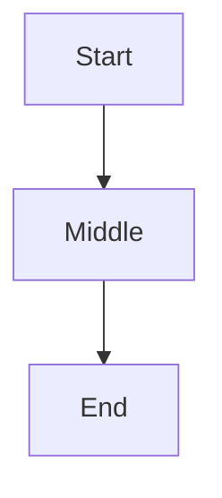

# Plan Explorer Skill Implementation Plan

> **For agentic workers:** REQUIRED SUB-SKILL: Use superpowers:subagent-driven-development (recommended) or superpowers:executing-plans to implement this plan task-by-task. Steps use checkbox (`- [ ]`) syntax for tracking.

**Goal:** Build a skill that opens any markdown plan/spec in a Notion-like browser UI for interactive exploration and editing, round-tripping edits to disk.

**Architecture:** Thin Python stdlib HTTP server (read/write/SSE) + fat vanilla-JS client that parses markdown with vendored `marked.js`, renders Design B (soft Notion + Arc) UI, and round-trips edits with ETag concurrency control.

**Tech Stack:** Python 3 stdlib (`http.server`, `threading`, `pathlib`), pytest (server tests), Playwright (E2E client tests), vanilla JS (no build step), marked.js (vendored ~50KB), mermaid.js (vendored, Tier 3), CSS Grid.

**Spec:** `docs/superpowers/specs/2026-05-20-plan-explorer-design.md`

---

## File Structure

```
~/.claude/skills/plan-explorer/
├── SKILL.md                       # frontmatter + invocation guide (Claude reads this)
├── scripts/
│   ├── plan-explore               # python entrypoint (executable)
│   └── server.py                  # http + SSE server (imported by launcher)
├── static/
│   ├── index.html                 # single-page shell
│   ├── app.js                     # ~400 LOC: parser, renderer, sidebar, editor, sync, mode
│   ├── styles.css                 # Design B theme + dark mode
│   └── vendor/
│       ├── marked.min.js          # vendored markdown parser
│       └── mermaid.min.js         # vendored diagram renderer (Tier 3)
└── tests/
    ├── conftest.py                # pytest fixtures (free port, tmp md file, server subprocess)
    ├── test_server.py             # stdlib + pytest server tests
    ├── test_client.py             # playwright E2E (dev-only)
    └── fixtures/
        ├── plan.md                # plan-mode fixture (checkboxes)
        ├── spec.md                # doc-mode fixture (no checkboxes)
        └── rich.md                # callouts + code + mermaid + tables
```

Each file has one responsibility:
- **`server.py`** — HTTP routing, auth, file I/O, SSE polling
- **`app.js`** — all client logic; intentionally single file (no build step)
- **`styles.css`** — Design B visual rules; theme variables only
- **`plan-explore`** — argument parsing, port pick, subprocess spawn, browser open, cleanup

---

## Phase 1 — Skill Scaffold + Launcher

### Task 1: Create skill directory and SKILL.md

**Files:**
- Create: `~/.claude/skills/plan-explorer/SKILL.md`

- [ ] **Step 1: Create directory tree**

```bash
mkdir -p ~/.claude/skills/plan-explorer/{scripts,static/vendor,tests/fixtures}
```

- [ ] **Step 2: Write SKILL.md**

```markdown
---
name: plan-explorer
description: Open a markdown plan, spec, or design doc in a beautiful browser UI for interactive exploration and editing. Round-trips edits to disk. Use when the user types /plan-explore <path>, asks to "open this plan in a browser", or wants to visually navigate phases of an implementation plan.
---

# Plan Explorer

When user invokes `/plan-explore <path>` or asks to open a plan/spec visually:

1. Validate `<path>` is an absolute path to an existing `.md` file
2. Run: `~/.claude/skills/plan-explorer/scripts/plan-explore <path>`
3. The launcher prints a URL; share it with the user
4. The launcher runs until the user Ctrl-Cs it

The UI auto-detects mode:
- **Plan mode** — file contains `- [ ]` checkboxes → shows phase badges + progress
- **Doc mode** — no checkboxes → shows nested TOC + clean reading view

User can edit blocks click-to-edit; changes save to the original `.md` file.

## Limitations

- One file per session
- Chromium-based browsers and Firefox supported (Safari best-effort)
- Server binds 127.0.0.1 only; not for remote access
```

- [ ] **Step 3: Commit**

```bash
cd ~/.claude
git add skills/plan-explorer/SKILL.md
git commit -m "feat(plan-explorer): scaffold skill directory and SKILL.md"
```

---

### Task 2: Launcher argument parsing + path validation

**Files:**
- Create: `~/.claude/skills/plan-explorer/scripts/plan-explore`
- Create: `~/.claude/skills/plan-explorer/tests/conftest.py`
- Create: `~/.claude/skills/plan-explorer/tests/test_launcher.py`

- [ ] **Step 1: Write conftest.py**

```python
# ~/.claude/skills/plan-explorer/tests/conftest.py
import socket
import subprocess
import tempfile
from pathlib import Path

import pytest

SKILL_DIR = Path(__file__).resolve().parent.parent
LAUNCHER = SKILL_DIR / "scripts" / "plan-explore"
SERVER = SKILL_DIR / "scripts" / "server.py"


@pytest.fixture
def free_port():
    with socket.socket() as s:
        s.bind(("127.0.0.1", 0))
        return s.getsockname()[1]


@pytest.fixture
def tmp_md(tmp_path):
    f = tmp_path / "plan.md"
    f.write_text("# Title\n\n## Phase 1\n\n- [ ] task\n")
    return f
```

- [ ] **Step 2: Write failing test for path validation**

```python
# ~/.claude/skills/plan-explorer/tests/test_launcher.py
import subprocess
from .conftest import LAUNCHER


def test_missing_path_exits_nonzero():
    r = subprocess.run([str(LAUNCHER)], capture_output=True, text=True)
    assert r.returncode != 0
    assert "path" in r.stderr.lower()


def test_nonexistent_path_exits_nonzero():
    r = subprocess.run([str(LAUNCHER), "/no/such/file.md"], capture_output=True, text=True)
    assert r.returncode != 0
    assert "not found" in r.stderr.lower() or "no such" in r.stderr.lower()


def test_wrong_extension_exits_nonzero(tmp_path):
    f = tmp_path / "plan.txt"
    f.write_text("x")
    r = subprocess.run([str(LAUNCHER), str(f)], capture_output=True, text=True)
    assert r.returncode != 0
    assert ".md" in r.stderr
```

- [ ] **Step 3: Run tests to verify they fail**

```bash
cd ~/.claude/skills/plan-explorer
python -m pytest tests/test_launcher.py -v
```

Expected: FAIL — launcher does not exist yet.

- [ ] **Step 4: Write launcher (validation only, no server yet)**

```python
#!/usr/bin/env python3
# ~/.claude/skills/plan-explorer/scripts/plan-explore
"""Launch the Plan Explorer browser UI for a markdown file."""

import argparse
import sys
from pathlib import Path


def main():
    parser = argparse.ArgumentParser(description="Open a markdown plan in the browser")
    parser.add_argument("path", help="path to the .md file")
    parser.add_argument("--port", type=int, help="override port (default: pick free 51000-51100)")
    parser.add_argument("--no-open", action="store_true", help="skip opening browser")
    args = parser.parse_args()

    path = Path(args.path).expanduser().resolve()
    if not path.exists():
        print(f"error: file not found: {path}", file=sys.stderr)
        sys.exit(1)
    if path.suffix != ".md":
        print(f"error: expected a .md file, got {path.suffix}", file=sys.stderr)
        sys.exit(1)

    print(f"validated: {path}")
    # next task: spawn server


if __name__ == "__main__":
    main()
```

- [ ] **Step 5: Make executable**

```bash
chmod +x ~/.claude/skills/plan-explorer/scripts/plan-explore
```

- [ ] **Step 6: Run tests to verify they pass**

```bash
cd ~/.claude/skills/plan-explorer
python -m pytest tests/test_launcher.py -v
```

Expected: 3 passed.

- [ ] **Step 7: Commit**

```bash
cd ~/.claude
git add skills/plan-explorer/scripts/plan-explore skills/plan-explorer/tests/
git commit -m "feat(plan-explorer): launcher argument parsing and path validation"
```

---

### Task 3: Pick free port and generate token

**Files:**
- Modify: `~/.claude/skills/plan-explorer/scripts/plan-explore`
- Modify: `~/.claude/skills/plan-explorer/tests/test_launcher.py`

- [ ] **Step 1: Add failing tests for port/token**

```python
# append to tests/test_launcher.py
import re


def test_no_open_prints_url(tmp_md):
    r = subprocess.run(
        [str(LAUNCHER), str(tmp_md), "--no-open", "--port", "0"],
        capture_output=True, text=True, timeout=5,
    )
    # Server will be killed by --no-open semantics in a later task;
    # for now we accept either successful exit or timeout, but URL must appear.
    output = r.stdout + r.stderr
    assert re.search(r"http://127\.0\.0\.1:\d+/\?t=[0-9a-f]{32}", output), output
```

- [ ] **Step 2: Run to verify FAIL**

```bash
python -m pytest tests/test_launcher.py::test_no_open_prints_url -v
```

Expected: FAIL — launcher does not print URL yet.

- [ ] **Step 3: Extend launcher with port pick + token + URL print**

```python
#!/usr/bin/env python3
# ~/.claude/skills/plan-explorer/scripts/plan-explore
"""Launch the Plan Explorer browser UI for a markdown file."""

import argparse
import secrets
import socket
import sys
from pathlib import Path

PORT_RANGE = range(51000, 51101)


def pick_port(preferred: int | None) -> int:
    candidates = [preferred] if preferred and preferred > 0 else list(PORT_RANGE)
    for p in candidates:
        with socket.socket() as s:
            try:
                s.bind(("127.0.0.1", p))
                return s.getsockname()[1]
            except OSError:
                continue
    print("error: no free port in 51000-51100", file=sys.stderr)
    sys.exit(1)


def main():
    parser = argparse.ArgumentParser(description="Open a markdown plan in the browser")
    parser.add_argument("path", help="path to the .md file")
    parser.add_argument("--port", type=int, default=0, help="override port (0 = pick free)")
    parser.add_argument("--no-open", action="store_true", help="skip opening browser")
    args = parser.parse_args()

    path = Path(args.path).expanduser().resolve()
    if not path.exists():
        print(f"error: file not found: {path}", file=sys.stderr)
        sys.exit(1)
    if path.suffix != ".md":
        print(f"error: expected a .md file, got {path.suffix}", file=sys.stderr)
        sys.exit(1)

    port = pick_port(args.port if args.port > 0 else None)
    token = secrets.token_hex(16)
    url = f"http://127.0.0.1:{port}/?t={token}"
    print(f"plan-explore serving {path}")
    print(f"url: {url}")
    # next task: spawn server.py with (path, token, port)


if __name__ == "__main__":
    main()
```

- [ ] **Step 4: Run test to verify PASS**

```bash
python -m pytest tests/test_launcher.py -v
```

Expected: 4 passed.

- [ ] **Step 5: Commit**

```bash
cd ~/.claude
git add skills/plan-explorer/
git commit -m "feat(plan-explorer): port picking and token generation"
```

---

### Task 4: Minimal server skeleton — `GET /` returns 200

**Files:**
- Create: `~/.claude/skills/plan-explorer/scripts/server.py`
- Create: `~/.claude/skills/plan-explorer/tests/test_server.py`

- [ ] **Step 1: Write failing test**

```python
# ~/.claude/skills/plan-explorer/tests/test_server.py
import http.client
import subprocess
import sys
import time
from .conftest import SERVER


def start_server(path, token, port):
    proc = subprocess.Popen(
        [sys.executable, str(SERVER), str(path), token, str(port)],
        stdout=subprocess.PIPE, stderr=subprocess.PIPE,
    )
    time.sleep(0.3)
    return proc


def test_root_returns_200(tmp_md, free_port):
    token = "a" * 32
    proc = start_server(tmp_md, token, free_port)
    try:
        conn = http.client.HTTPConnection("127.0.0.1", free_port, timeout=2)
        conn.request("GET", f"/?t={token}")
        resp = conn.getresponse()
        assert resp.status == 200
        body = resp.read().decode()
        assert "<html" in body.lower()
    finally:
        proc.terminate()
        proc.wait(timeout=2)
```

- [ ] **Step 2: Run to verify FAIL**

```bash
python -m pytest tests/test_server.py::test_root_returns_200 -v
```

Expected: FAIL — server.py does not exist.

- [ ] **Step 3: Write minimal server**

```python
#!/usr/bin/env python3
# ~/.claude/skills/plan-explorer/scripts/server.py
"""Plan Explorer HTTP server. Bound to 127.0.0.1 only."""

import sys
from http.server import ThreadingHTTPServer, BaseHTTPRequestHandler
from pathlib import Path
from urllib.parse import urlparse, parse_qs

STATIC_DIR = Path(__file__).resolve().parent.parent / "static"


class State:
    plan_path: Path
    token: str


class Handler(BaseHTTPRequestHandler):
    def log_message(self, fmt, *args):
        sys.stderr.write("[server] " + fmt % args + "\n")

    def _check_token(self) -> bool:
        qs = parse_qs(urlparse(self.path).query)
        provided = (qs.get("t") or [None])[0] or self.headers.get("X-Auth-Token")
        if provided != State.token:
            self.send_error(401, "auth required")
            return False
        return True

    def do_GET(self):
        if not self._check_token():
            return
        url = urlparse(self.path)
        if url.path == "/":
            self._serve_file(STATIC_DIR / "index.html", "text/html; charset=utf-8")
        else:
            self.send_error(404)

    def _serve_file(self, path: Path, content_type: str):
        if not path.exists():
            self.send_error(404)
            return
        data = path.read_bytes()
        self.send_response(200)
        self.send_header("Content-Type", content_type)
        self.send_header("Content-Length", str(len(data)))
        self.end_headers()
        self.wfile.write(data)


def main():
    plan_path = Path(sys.argv[1]).resolve()
    State.plan_path = plan_path
    State.token = sys.argv[2]
    port = int(sys.argv[3])
    httpd = ThreadingHTTPServer(("127.0.0.1", port), Handler)
    print(f"[server] listening on 127.0.0.1:{port}", flush=True)
    httpd.serve_forever()


if __name__ == "__main__":
    main()
```

- [ ] **Step 4: Create placeholder index.html**

```bash
cat > ~/.claude/skills/plan-explorer/static/index.html << 'EOF'
<!DOCTYPE html>
<html><head><title>Plan Explorer</title></head><body>placeholder</body></html>
EOF
```

- [ ] **Step 5: Run test to verify PASS**

```bash
python -m pytest tests/test_server.py -v
```

Expected: 1 passed.

- [ ] **Step 6: Commit**

```bash
cd ~/.claude
git add skills/plan-explorer/
git commit -m "feat(plan-explorer): minimal HTTP server with token auth"
```

---

### Task 5: Token auth — 401 on missing/wrong token

**Files:**
- Modify: `~/.claude/skills/plan-explorer/tests/test_server.py`

- [ ] **Step 1: Add failing tests**

```python
# append to tests/test_server.py

def test_missing_token_returns_401(tmp_md, free_port):
    token = "b" * 32
    proc = start_server(tmp_md, token, free_port)
    try:
        conn = http.client.HTTPConnection("127.0.0.1", free_port, timeout=2)
        conn.request("GET", "/")
        assert conn.getresponse().status == 401
    finally:
        proc.terminate(); proc.wait(timeout=2)


def test_wrong_token_returns_401(tmp_md, free_port):
    token = "c" * 32
    proc = start_server(tmp_md, token, free_port)
    try:
        conn = http.client.HTTPConnection("127.0.0.1", free_port, timeout=2)
        conn.request("GET", "/?t=wrong")
        assert conn.getresponse().status == 401
    finally:
        proc.terminate(); proc.wait(timeout=2)
```

- [ ] **Step 2: Run tests**

```bash
python -m pytest tests/test_server.py -v
```

Expected: PASS — already implemented in Task 4.

- [ ] **Step 3: Commit (no code change; just lock in coverage)**

```bash
cd ~/.claude
git add skills/plan-explorer/tests/test_server.py
git commit -m "test(plan-explorer): cover token auth failure modes"
```

---

### Task 6: Static file serving + path traversal guard

**Files:**
- Modify: `~/.claude/skills/plan-explorer/scripts/server.py`
- Modify: `~/.claude/skills/plan-explorer/tests/test_server.py`

- [ ] **Step 1: Add failing tests**

```python
# append to tests/test_server.py

def test_static_file_served(tmp_md, free_port, tmp_path):
    # create a static asset by reaching into the skill dir
    from .conftest import SKILL_DIR
    asset = SKILL_DIR / "static" / "_probe.txt"
    asset.write_text("hello")
    try:
        token = "d" * 32
        proc = start_server(tmp_md, token, free_port)
        try:
            conn = http.client.HTTPConnection("127.0.0.1", free_port, timeout=2)
            conn.request("GET", f"/static/_probe.txt?t={token}")
            resp = conn.getresponse()
            assert resp.status == 200
            assert resp.read().decode() == "hello"
        finally:
            proc.terminate(); proc.wait(timeout=2)
    finally:
        asset.unlink()


def test_path_traversal_blocked(tmp_md, free_port):
    token = "e" * 32
    proc = start_server(tmp_md, token, free_port)
    try:
        conn = http.client.HTTPConnection("127.0.0.1", free_port, timeout=2)
        conn.request("GET", f"/static/../../../etc/passwd?t={token}")
        assert conn.getresponse().status in (400, 403, 404)
    finally:
        proc.terminate(); proc.wait(timeout=2)
```

- [ ] **Step 2: Run to verify FAIL**

```bash
python -m pytest tests/test_server.py -v
```

Expected: 2 new tests fail.

- [ ] **Step 3: Implement `/static/*` route with guard**

Add to `server.py` `do_GET`:

```python
        if url.path == "/":
            self._serve_file(STATIC_DIR / "index.html", "text/html; charset=utf-8")
        elif url.path.startswith("/static/"):
            self._serve_static(url.path[len("/static/"):])
        else:
            self.send_error(404)
```

Add helper:

```python
    _MIME = {
        ".html": "text/html; charset=utf-8",
        ".js":   "application/javascript",
        ".css":  "text/css",
        ".json": "application/json",
        ".svg":  "image/svg+xml",
        ".txt":  "text/plain; charset=utf-8",
    }

    def _serve_static(self, rel: str):
        try:
            target = (STATIC_DIR / rel).resolve()
        except OSError:
            self.send_error(400)
            return
        if STATIC_DIR not in target.parents and target != STATIC_DIR:
            self.send_error(403)
            return
        if not target.is_file():
            self.send_error(404)
            return
        ext = target.suffix
        self._serve_file(target, self._MIME.get(ext, "application/octet-stream"))
```

- [ ] **Step 4: Run to verify PASS**

```bash
python -m pytest tests/test_server.py -v
```

Expected: all passing.

- [ ] **Step 5: Commit**

```bash
cd ~/.claude
git add skills/plan-explorer/scripts/server.py skills/plan-explorer/tests/test_server.py
git commit -m "feat(plan-explorer): static file serving with traversal guard"
```

---

### Task 7: Wire launcher to spawn server.py and handle Ctrl-C

**Files:**
- Modify: `~/.claude/skills/plan-explorer/scripts/plan-explore`
- Modify: `~/.claude/skills/plan-explorer/tests/test_launcher.py`

- [ ] **Step 1: Failing test — launcher spawns server reachable on URL**

```python
# append to tests/test_launcher.py
import http.client
import time


def test_launcher_serves_index(tmp_md):
    proc = subprocess.Popen(
        [str(LAUNCHER), str(tmp_md), "--no-open"],
        stdout=subprocess.PIPE, stderr=subprocess.PIPE, text=True,
    )
    try:
        # capture URL from stdout
        url = None
        deadline = time.time() + 3
        while time.time() < deadline:
            line = proc.stdout.readline()
            if "url:" in line:
                url = line.split("url:")[1].strip()
                break
        assert url, "launcher did not print URL"
        port = int(re.search(r":(\d+)/", url).group(1))
        token = re.search(r"t=([0-9a-f]+)", url).group(1)
        time.sleep(0.3)
        conn = http.client.HTTPConnection("127.0.0.1", port, timeout=2)
        conn.request("GET", f"/?t={token}")
        assert conn.getresponse().status == 200
    finally:
        proc.terminate(); proc.wait(timeout=2)
```

- [ ] **Step 2: Run to verify FAIL**

Expected: launcher does not actually spawn the server yet.

- [ ] **Step 3: Extend launcher**

Replace the trailing `# next task` block with:

```python
    import subprocess, signal, webbrowser, atexit, os, time

    server_script = Path(__file__).resolve().parent / "server.py"
    proc = subprocess.Popen(
        [sys.executable, str(server_script), str(path), token, str(port)],
    )

    def cleanup(*_):
        if proc.poll() is None:
            proc.terminate()
            try:
                proc.wait(timeout=2)
            except subprocess.TimeoutExpired:
                proc.kill()

    atexit.register(cleanup)
    signal.signal(signal.SIGINT, lambda *_: (cleanup(), sys.exit(0)))
    signal.signal(signal.SIGTERM, lambda *_: (cleanup(), sys.exit(0)))

    # wait briefly for server to bind
    time.sleep(0.3)
    if proc.poll() is not None:
        print("error: server failed to start", file=sys.stderr)
        sys.exit(1)

    if not args.no_open:
        webbrowser.open(url)

    print("press Ctrl-C to stop")
    proc.wait()
```

- [ ] **Step 4: Run tests**

```bash
python -m pytest tests/ -v
```

Expected: all passing.

- [ ] **Step 5: Manual smoke**

```bash
~/.claude/skills/plan-explorer/scripts/plan-explore /tmp/x.md 2>/dev/null || true
echo "# Smoke" > /tmp/x.md
~/.claude/skills/plan-explorer/scripts/plan-explore /tmp/x.md --no-open &
sleep 1
curl -sS "http://127.0.0.1:$(...)" # use printed url
kill %1
```

Confirm placeholder loads.

- [ ] **Step 6: Commit**

```bash
cd ~/.claude
git add skills/plan-explorer/
git commit -m "feat(plan-explorer): launcher spawns server and handles signals"
```

---

## Phase 2 — Read/Write Endpoints

### Task 8: `GET /plan` returns markdown + ETag

**Files:**
- Modify: `~/.claude/skills/plan-explorer/scripts/server.py`
- Modify: `~/.claude/skills/plan-explorer/tests/test_server.py`

- [ ] **Step 1: Failing test**

```python
# append to tests/test_server.py

def test_get_plan_returns_body_and_etag(tmp_md, free_port):
    token = "f" * 32
    proc = start_server(tmp_md, token, free_port)
    try:
        conn = http.client.HTTPConnection("127.0.0.1", free_port, timeout=2)
        conn.request("GET", f"/plan?t={token}")
        resp = conn.getresponse()
        body = resp.read().decode()
        assert resp.status == 200
        assert body == tmp_md.read_text()
        assert resp.getheader("ETag")
        assert resp.getheader("Content-Type", "").startswith("text/markdown")
    finally:
        proc.terminate(); proc.wait(timeout=2)
```

- [ ] **Step 2: Run FAIL**

- [ ] **Step 3: Add `/plan` GET route**

In `server.py` `do_GET`, add before the 404 branch:

```python
        elif url.path == "/plan":
            self._serve_plan()
```

Add helper:

```python
    def _serve_plan(self):
        path = State.plan_path
        if not path.exists():
            self.send_error(410, "plan file gone")
            return
        data = path.read_bytes()
        etag = f'"{path.stat().st_mtime_ns}"'
        self.send_response(200)
        self.send_header("Content-Type", "text/markdown; charset=utf-8")
        self.send_header("ETag", etag)
        self.send_header("Content-Length", str(len(data)))
        self.end_headers()
        self.wfile.write(data)
```

- [ ] **Step 4: Run PASS**

- [ ] **Step 5: Commit**

```bash
cd ~/.claude
git add skills/plan-explorer/
git commit -m "feat(plan-explorer): GET /plan returns markdown with mtime ETag"
```

---

### Task 9: `PUT /plan` atomic write

**Files:**
- Modify: `~/.claude/skills/plan-explorer/scripts/server.py`
- Modify: `~/.claude/skills/plan-explorer/tests/test_server.py`

- [ ] **Step 1: Failing test**

```python
# append to tests/test_server.py

def test_put_plan_writes_atomically(tmp_md, free_port):
    token = "g" * 32
    proc = start_server(tmp_md, token, free_port)
    try:
        new_body = "# New\n\n## Phase 2\n\n- [x] changed\n"
        conn = http.client.HTTPConnection("127.0.0.1", free_port, timeout=2)
        conn.request("PUT", f"/plan?t={token}", body=new_body,
                     headers={"Content-Type": "text/markdown; charset=utf-8"})
        resp = conn.getresponse()
        assert resp.status == 200
        new_etag = resp.getheader("ETag")
        assert new_etag
        assert tmp_md.read_text() == new_body
    finally:
        proc.terminate(); proc.wait(timeout=2)
```

- [ ] **Step 2: Run FAIL**

- [ ] **Step 3: Add `do_PUT` to handler**

```python
    MAX_BODY = 5 * 1024 * 1024  # 5 MB

    def do_PUT(self):
        if not self._check_token():
            return
        url = urlparse(self.path)
        if url.path != "/plan":
            self.send_error(404)
            return
        length = int(self.headers.get("Content-Length") or 0)
        if length > self.MAX_BODY:
            self.send_error(413, "plan too large")
            return
        body = self.rfile.read(length)
        path = State.plan_path
        tmp = path.with_suffix(path.suffix + ".tmp")
        tmp.write_bytes(body)
        os.replace(tmp, path)
        etag = f'"{path.stat().st_mtime_ns}"'
        State.last_self_write_ns = path.stat().st_mtime_ns  # for SSE suppression (Task 13)
        self.send_response(200)
        self.send_header("ETag", etag)
        self.send_header("Content-Length", "0")
        self.end_headers()
```

Add to top of `server.py`:

```python
import os
```

Add to `State`:

```python
class State:
    plan_path: Path
    token: str
    last_self_write_ns: int = 0
```

- [ ] **Step 4: Run PASS**

- [ ] **Step 5: Commit**

```bash
cd ~/.claude
git add skills/plan-explorer/
git commit -m "feat(plan-explorer): PUT /plan with atomic write and 5MB cap"
```

---

### Task 10: ETag concurrency — `If-Match` mismatch returns 412

**Files:**
- Modify: `~/.claude/skills/plan-explorer/scripts/server.py`
- Modify: `~/.claude/skills/plan-explorer/tests/test_server.py`

- [ ] **Step 1: Failing tests**

```python
# append to tests/test_server.py

def test_put_stale_etag_returns_412(tmp_md, free_port):
    token = "h" * 32
    proc = start_server(tmp_md, token, free_port)
    try:
        conn = http.client.HTTPConnection("127.0.0.1", free_port, timeout=2)
        conn.request("PUT", f"/plan?t={token}", body="x",
                     headers={"If-Match": '"0"'})
        assert conn.getresponse().status == 412
    finally:
        proc.terminate(); proc.wait(timeout=2)


def test_put_size_limit_returns_413(tmp_md, free_port):
    token = "i" * 32
    proc = start_server(tmp_md, token, free_port)
    try:
        body = "x" * (6 * 1024 * 1024)
        conn = http.client.HTTPConnection("127.0.0.1", free_port, timeout=2)
        conn.request("PUT", f"/plan?t={token}", body=body)
        assert conn.getresponse().status == 413
    finally:
        proc.terminate(); proc.wait(timeout=2)
```

- [ ] **Step 2: Run FAIL**

- [ ] **Step 3: Add If-Match check in `do_PUT`**

Before the write block:

```python
        if_match = self.headers.get("If-Match")
        if if_match:
            current_etag = f'"{State.plan_path.stat().st_mtime_ns}"'
            if if_match != current_etag:
                self.send_error(412, "etag mismatch")
                return
```

- [ ] **Step 4: Run PASS**

- [ ] **Step 5: Commit**

```bash
cd ~/.claude
git add skills/plan-explorer/
git commit -m "feat(plan-explorer): ETag If-Match concurrency control"
```

---

## Phase 3 — SSE for External Edits

### Task 11: `GET /events` SSE stream that emits `change` on mtime shift

**Files:**
- Modify: `~/.claude/skills/plan-explorer/scripts/server.py`
- Modify: `~/.claude/skills/plan-explorer/tests/test_server.py`

- [ ] **Step 1: Failing test**

```python
# append to tests/test_server.py
import threading


def test_sse_emits_on_external_change(tmp_md, free_port):
    token = "j" * 32
    proc = start_server(tmp_md, token, free_port)
    try:
        events = []

        def reader():
            conn = http.client.HTTPConnection("127.0.0.1", free_port, timeout=3)
            conn.request("GET", f"/events?t={token}")
            resp = conn.getresponse()
            for _ in range(20):
                line = resp.fp.readline().decode()
                if line.startswith("data:"):
                    events.append(line)
                    return

        t = threading.Thread(target=reader, daemon=True)
        t.start()
        time.sleep(0.4)
        tmp_md.write_text(tmp_md.read_text() + "\nextra\n")
        t.join(timeout=3)
        assert any("change" in e for e in events), events
    finally:
        proc.terminate(); proc.wait(timeout=2)
```

- [ ] **Step 2: Run FAIL**

- [ ] **Step 3: Add `/events` SSE route**

In `do_GET`:

```python
        elif url.path == "/events":
            self._stream_events()
```

Add helper:

```python
    def _stream_events(self):
        self.send_response(200)
        self.send_header("Content-Type", "text/event-stream")
        self.send_header("Cache-Control", "no-cache")
        self.send_header("Connection", "keep-alive")
        self.end_headers()
        path = State.plan_path
        last_ns = path.stat().st_mtime_ns if path.exists() else 0
        try:
            while True:
                time.sleep(0.5)
                if not path.exists():
                    self.wfile.write(b'data: {"type":"gone"}\n\n')
                    self.wfile.flush()
                    return
                cur_ns = path.stat().st_mtime_ns
                if cur_ns != last_ns and cur_ns != State.last_self_write_ns:
                    last_ns = cur_ns
                    etag = f'"{cur_ns}"'
                    self.wfile.write(
                        f'data: {{"type":"change","etag":{etag}}}\n\n'.encode()
                    )
                    self.wfile.flush()
                else:
                    last_ns = cur_ns
        except (BrokenPipeError, ConnectionResetError):
            return
```

Add `import time` at top of `server.py`.

- [ ] **Step 4: Run PASS**

- [ ] **Step 5: Commit**

```bash
cd ~/.claude
git add skills/plan-explorer/
git commit -m "feat(plan-explorer): SSE /events stream on external file changes"
```

---

### Task 12: SSE suppress self-writes for 1s after PUT

**Files:**
- Modify: `~/.claude/skills/plan-explorer/scripts/server.py`
- Modify: `~/.claude/skills/plan-explorer/tests/test_server.py`

- [ ] **Step 1: Failing test**

```python
# append to tests/test_server.py

def test_sse_suppresses_after_own_put(tmp_md, free_port):
    token = "k" * 32
    proc = start_server(tmp_md, token, free_port)
    try:
        # subscribe first
        sub = http.client.HTTPConnection("127.0.0.1", free_port, timeout=3)
        sub.request("GET", f"/events?t={token}")
        resp = sub.getresponse()
        # do our own PUT
        put = http.client.HTTPConnection("127.0.0.1", free_port, timeout=2)
        put.request("PUT", f"/plan?t={token}", body="# new\n")
        assert put.getresponse().status == 200
        # try to read an event within 0.8s — should NOT see a change
        sub.sock.settimeout(0.8)
        try:
            line = resp.fp.readline().decode()
        except Exception:
            line = ""
        assert "change" not in line, f"unexpected event: {line}"
    finally:
        proc.terminate(); proc.wait(timeout=2)
```

- [ ] **Step 2: Run to verify**

Expected: PASS — already handled in Task 11 via `last_self_write_ns`.

- [ ] **Step 3: Commit (lock coverage)**

```bash
cd ~/.claude
git add skills/plan-explorer/tests/test_server.py
git commit -m "test(plan-explorer): verify SSE suppresses self-writes"
```

---

### Task 13: File-deletion SSE `{"type":"gone"}`

**Files:**
- Modify: `~/.claude/skills/plan-explorer/tests/test_server.py`

- [ ] **Step 1: Failing test**

```python
# append to tests/test_server.py

def test_sse_emits_gone_on_delete(tmp_md, free_port):
    token = "l" * 32
    proc = start_server(tmp_md, token, free_port)
    try:
        events = []

        def reader():
            conn = http.client.HTTPConnection("127.0.0.1", free_port, timeout=3)
            conn.request("GET", f"/events?t={token}")
            resp = conn.getresponse()
            for _ in range(20):
                line = resp.fp.readline().decode()
                if line.startswith("data:"):
                    events.append(line); return

        t = threading.Thread(target=reader, daemon=True); t.start()
        time.sleep(0.4)
        tmp_md.unlink()
        t.join(timeout=3)
        assert any("gone" in e for e in events), events
    finally:
        proc.terminate(); proc.wait(timeout=2)
```

- [ ] **Step 2: Run to verify**

Expected: PASS — already handled in Task 11.

- [ ] **Step 3: Commit**

```bash
cd ~/.claude
git add skills/plan-explorer/tests/test_server.py
git commit -m "test(plan-explorer): verify SSE emits gone on file delete"
```

---

## Phase 4 — Client Shell

### Task 14: Vendor `marked.min.js` and write `index.html` shell

**Files:**
- Create: `~/.claude/skills/plan-explorer/static/vendor/marked.min.js`
- Modify: `~/.claude/skills/plan-explorer/static/index.html`
- Create: `~/.claude/skills/plan-explorer/static/styles.css`
- Create: `~/.claude/skills/plan-explorer/static/app.js`

- [ ] **Step 1: Vendor marked.js v12**

```bash
curl -fsSL -o ~/.claude/skills/plan-explorer/static/vendor/marked.min.js \
  https://cdn.jsdelivr.net/npm/marked@12/marked.min.js
# Verify size sanity
test "$(wc -c < ~/.claude/skills/plan-explorer/static/vendor/marked.min.js)" -gt 30000
```

- [ ] **Step 2: Write `index.html`**

```html
<!DOCTYPE html>
<html lang="en">
<head>
  <meta charset="UTF-8">
  <title>Plan Explorer</title>
  <link rel="stylesheet" href="/static/styles.css">
  <script src="/static/vendor/marked.min.js" defer></script>
  <script src="/static/app.js" defer type="module"></script>
</head>
<body>
  <div class="app">
    <aside id="sidebar"></aside>
    <main id="main">
      <header class="header">
        <div class="eyebrow" id="eyebrow">Implementation Plan</div>
        <h1 id="title">Loading…</h1>
        <div class="meta" id="meta"></div>
      </header>
      <section id="content"></section>
    </main>
  </div>
  <div id="toast"></div>
  <div id="conflict-modal" hidden></div>
</body>
</html>
```

- [ ] **Step 3: Stub `app.js`**

```javascript
// ~/.claude/skills/plan-explorer/static/app.js
const TOKEN = new URLSearchParams(location.search).get("t");

async function fetchPlan() {
  const r = await fetch(`/plan?t=${TOKEN}`);
  if (!r.ok) throw new Error(`load: ${r.status}`);
  return { body: await r.text(), etag: r.headers.get("ETag") };
}

window.addEventListener("DOMContentLoaded", async () => {
  try {
    const { body } = await fetchPlan();
    document.getElementById("content").textContent = body;
    document.getElementById("title").textContent = "(raw)";
  } catch (e) {
    document.getElementById("title").textContent = "Failed to load";
    console.error(e);
  }
});
```

- [ ] **Step 4: Stub `styles.css`**

```css
/* ~/.claude/skills/plan-explorer/static/styles.css */
:root {
  --bg: #fbfaf7; --surface: #fff; --text: #1a1a1a; --muted: #6b6b6b;
  --border: #ececea; --hover: #f3f2ee;
  --done: #d1fae5; --done-fg: #047857;
  --wip: #fef3c7; --wip-fg: #b45309;
  --todo: #f4f4f5; --todo-fg: #71717a;
  --accent: #4a7afe;
}
body.dark {
  --bg:#1a1a1a; --surface:#232323; --text:#e8e8e8; --muted:#999;
  --border:#333; --hover:#2a2a2a;
}
* { box-sizing: border-box; }
body { margin: 0; font-family: "Inter", -apple-system, sans-serif;
       background: var(--bg); color: var(--text); font-size: 15px; line-height: 1.6; }
.app { display: grid; grid-template-columns: 240px 1fr; min-height: 100vh; }
aside { padding: 24px 14px; border-right: 1px solid var(--border); }
main { padding: 56px 72px; max-width: 820px; }
.header h1 { font-size: 40px; font-weight: 700; letter-spacing: -.02em; margin: 0; }
.eyebrow { font-size: 12px; color: var(--muted); text-transform: uppercase;
           letter-spacing: .08em; margin-bottom: 8px; }
```

- [ ] **Step 5: Manual smoke**

```bash
echo "# Hello\n\nbody" > /tmp/x.md
~/.claude/skills/plan-explorer/scripts/plan-explore /tmp/x.md
```

Confirm: title shows "(raw)", page background warm off-white, raw markdown shown in #content.

- [ ] **Step 6: Commit**

```bash
cd ~/.claude
git add skills/plan-explorer/static/
git commit -m "feat(plan-explorer): vendor marked.js and minimal client shell"
```

---

### Task 15: Parser — group blocks by H2 phase

**Files:**
- Modify: `~/.claude/skills/plan-explorer/static/app.js`
- Create: `~/.claude/skills/plan-explorer/tests/test_client.py`

Note: Browser code is exercised via Playwright tests starting in this task. If Playwright is unavailable, mark these tests skipped; they run in CI.

- [ ] **Step 1: Add Playwright fixture in conftest.py**

```python
# append to ~/.claude/skills/plan-explorer/tests/conftest.py
import re, time as _time

playwright = pytest.importorskip("playwright.sync_api")

@pytest.fixture
def page_loader(tmp_md, free_port):
    """Start server, return (page, etag, cleanup)."""
    from playwright.sync_api import sync_playwright
    token = "p" * 32
    proc = subprocess.Popen(
        [sys.executable, str(SERVER), str(tmp_md), token, str(free_port)],
        stdout=subprocess.PIPE, stderr=subprocess.PIPE,
    )
    _time.sleep(0.3)
    pw = sync_playwright().start()
    browser = pw.chromium.launch()
    page = browser.new_page()
    page.goto(f"http://127.0.0.1:{free_port}/?t={token}")
    yield page, tmp_md
    browser.close(); pw.stop()
    proc.terminate(); proc.wait(timeout=2)
```

- [ ] **Step 2: Failing test**

```python
# ~/.claude/skills/plan-explorer/tests/test_client.py
def test_phases_grouped_by_h2(page_loader):
    page, md = page_loader
    md.write_text("# Title\n\n## Phase A\n\nA body\n\n## Phase B\n\nB body\n")
    page.reload()
    page.wait_for_selector(".phase")
    assert page.locator(".phase").count() == 2
    assert page.locator(".phase >> nth=0 >> h2").inner_text() == "Phase A"
```

- [ ] **Step 3: Run FAIL**

```bash
python -m pytest tests/test_client.py -v
```

(Skip if Playwright not installed: `pip install playwright && playwright install chromium`)

- [ ] **Step 4: Implement parser**

Replace `app.js`:

```javascript
const TOKEN = new URLSearchParams(location.search).get("t");

function parsePhases(src) {
  // Split source into: prelude (everything before first H2) + array of phases
  // Each phase: { title, level: 2, raw, body, tokens }
  const tokens = marked.lexer(src);
  const phases = [];
  let prelude = [];
  let current = null;
  for (const tok of tokens) {
    if (tok.type === "heading" && tok.depth === 2) {
      if (current) phases.push(current);
      current = { title: tok.text, raw: tok.raw, body: [], tokens: [] };
      continue;
    }
    if (current) {
      current.body.push(tok.raw);
      current.tokens.push(tok);
    } else {
      prelude.push(tok);
    }
  }
  if (current) phases.push(current);
  return { prelude, phases };
}

async function fetchPlan() {
  const r = await fetch(`/plan?t=${TOKEN}`);
  if (!r.ok) throw new Error(`load: ${r.status}`);
  return { body: await r.text(), etag: r.headers.get("ETag") };
}

function renderPhases(phases) {
  const content = document.getElementById("content");
  content.replaceChildren();
  for (const phase of phases) {
    const el = document.createElement("section");
    el.className = "phase";
    el.innerHTML = `
      <header class="phase-head">
        <span class="chev">▾</span>
        <h2>${escapeHtml(phase.title)}</h2>
      </header>
      <div class="phase-body">${marked.parse(phase.body.join(""))}</div>
    `;
    content.appendChild(el);
  }
}

function escapeHtml(s) {
  return s.replace(/[&<>"']/g, c => ({"&":"&amp;","<":"&lt;",">":"&gt;",'"':"&quot;","'":"&#39;"}[c]));
}

window.addEventListener("DOMContentLoaded", async () => {
  const { body } = await fetchPlan();
  const { prelude, phases } = parsePhases(body);
  // Use H1 from prelude as title if present
  const h1 = prelude.find(t => t.type === "heading" && t.depth === 1);
  document.getElementById("title").textContent = h1 ? h1.text : "Plan";
  renderPhases(phases);
});
```

Add to `styles.css`:

```css
.phase { background: var(--surface); border: 1px solid var(--border);
         border-radius: 14px; padding: 24px 26px; margin-bottom: 16px; }
.phase-head { display: flex; align-items: center; gap: 14px; margin-bottom: 12px;
              cursor: pointer; user-select: none; }
.phase-head h2 { margin: 0; font-size: 20px; font-weight: 600; flex: 1; }
.chev { color: var(--muted); transition: transform .15s; }
.phase.collapsed .chev { transform: rotate(-90deg); }
.phase.collapsed .phase-body { display: none; }
```

- [ ] **Step 5: Run PASS**

- [ ] **Step 6: Commit**

```bash
cd ~/.claude
git add skills/plan-explorer/
git commit -m "feat(plan-explorer): parse and render phases from H2"
```

---

### Task 16: Sidebar — H2 navigation with active scroll-spy

**Files:**
- Modify: `~/.claude/skills/plan-explorer/static/app.js`
- Modify: `~/.claude/skills/plan-explorer/static/styles.css`
- Modify: `~/.claude/skills/plan-explorer/tests/test_client.py`

- [ ] **Step 1: Failing test**

```python
# append to test_client.py
def test_sidebar_lists_phases(page_loader):
    page, md = page_loader
    md.write_text("# T\n\n## P1\n\nx\n\n## P2\n\ny\n")
    page.reload()
    page.wait_for_selector(".nav-item")
    items = page.locator(".nav-item").all_text_contents()
    assert "P1" in "".join(items)
    assert "P2" in "".join(items)
```

- [ ] **Step 2: Run FAIL**

- [ ] **Step 3: Implement sidebar**

In `app.js`, add after `renderPhases`:

```javascript
function renderSidebar(phases) {
  const side = document.getElementById("sidebar");
  side.replaceChildren();
  phases.forEach((p, i) => {
    const item = document.createElement("a");
    item.className = "nav-item";
    item.href = `#phase-${i}`;
    item.innerHTML = `<div class="pill todo">${i+1}</div><span>${escapeHtml(p.title)}</span>`;
    side.appendChild(item);
  });
}
```

In `renderPhases` set `el.id = "phase-" + index`. Adjust signature:

```javascript
function renderPhases(phases) {
  const content = document.getElementById("content");
  content.replaceChildren();
  phases.forEach((phase, i) => {
    const el = document.createElement("section");
    el.className = "phase"; el.id = `phase-${i}`;
    el.innerHTML = `
      <header class="phase-head">
        <span class="chev">▾</span>
        <h2>${escapeHtml(phase.title)}</h2>
      </header>
      <div class="phase-body">${marked.parse(phase.body.join(""))}</div>
    `;
    content.appendChild(el);
  });
}
```

In DOMContentLoaded:

```javascript
renderPhases(phases);
renderSidebar(phases);
attachScrollSpy();
attachCollapse();
```

Add helpers:

```javascript
function attachScrollSpy() {
  const obs = new IntersectionObserver((entries) => {
    for (const e of entries) {
      if (e.isIntersecting) {
        document.querySelectorAll(".nav-item.active").forEach(n => n.classList.remove("active"));
        const id = e.target.id;
        document.querySelector(`.nav-item[href="#${id}"]`)?.classList.add("active");
      }
    }
  }, { rootMargin: "-40% 0px -55% 0px" });
  document.querySelectorAll(".phase").forEach(p => obs.observe(p));
}

function attachCollapse() {
  document.querySelectorAll(".phase-head").forEach(h => {
    h.addEventListener("click", () => h.parentElement.classList.toggle("collapsed"));
  });
}
```

Add to `styles.css`:

```css
.nav-item { display: flex; align-items: center; gap: 10px; padding: 8px 10px;
            border-radius: 8px; color: var(--text); text-decoration: none;
            font-size: 14px; margin-bottom: 1px; }
.nav-item:hover { background: rgba(0,0,0,.04); }
.nav-item.active { background: var(--surface); box-shadow: 0 1px 3px rgba(0,0,0,.06);
                   font-weight: 500; }
.nav-item .pill { width: 22px; height: 22px; border-radius: 7px; flex-shrink: 0;
                  display: flex; align-items: center; justify-content: center;
                  font-size: 12px; font-weight: 600;
                  background: var(--todo); color: var(--todo-fg); }
.nav-item .pill.done { background: var(--done); color: var(--done-fg); }
.nav-item .pill.wip  { background: var(--wip);  color: var(--wip-fg); }
aside { position: sticky; top: 0; height: 100vh; overflow-y: auto; }
```

- [ ] **Step 4: Run PASS**

- [ ] **Step 5: Commit**

```bash
cd ~/.claude
git add skills/plan-explorer/
git commit -m "feat(plan-explorer): sidebar nav with scroll-spy and collapsible phases"
```

---

### Task 17: Mode detection — plan vs doc

**Files:**
- Modify: `~/.claude/skills/plan-explorer/static/app.js`
- Modify: `~/.claude/skills/plan-explorer/tests/test_client.py`

- [ ] **Step 1: Failing test**

```python
# append to test_client.py
def test_doc_mode_no_progress(page_loader):
    page, md = page_loader
    md.write_text("# Spec\n\n## Section A\n\nProse only\n")
    page.reload()
    page.wait_for_selector(".phase")
    assert page.locator("body.plan-mode").count() == 0
    assert page.locator("body.doc-mode").count() == 1
    assert page.locator("#progress-bar").count() == 0


def test_plan_mode_with_checkboxes(page_loader):
    page, md = page_loader
    md.write_text("# Plan\n\n## P1\n\n- [ ] do thing\n")
    page.reload()
    page.wait_for_selector(".phase")
    assert page.locator("body.plan-mode").count() == 1
```

- [ ] **Step 2: Run FAIL**

- [ ] **Step 3: Implement mode detection**

In `app.js`, before `renderPhases` call:

```javascript
const isPlan = /^\s*-\s*\[[ xX]\]/m.test(body);
document.body.classList.add(isPlan ? "plan-mode" : "doc-mode");
```

(Wraps existing flow — `body` is the markdown source string returned from fetchPlan.)

- [ ] **Step 4: Run PASS**

- [ ] **Step 5: Commit**

```bash
cd ~/.claude
git add skills/plan-explorer/
git commit -m "feat(plan-explorer): detect plan vs doc mode from checkbox presence"
```

---

## Phase 5 — Plan Mode Features

### Task 18: Phase status badges + progress bar

**Files:**
- Modify: `~/.claude/skills/plan-explorer/static/app.js`
- Modify: `~/.claude/skills/plan-explorer/static/styles.css`
- Modify: `~/.claude/skills/plan-explorer/tests/test_client.py`

- [ ] **Step 1: Failing test**

```python
# append to test_client.py
def test_phase_badges(page_loader):
    page, md = page_loader
    md.write_text(
        "# P\n\n## A\n\n- [x] x\n- [x] y\n\n## B\n\n- [x] x\n- [ ] y\n\n## C\n\n- [ ] x\n"
    )
    page.reload()
    page.wait_for_selector(".badge")
    assert page.locator(".badge.done").count() == 1
    assert page.locator(".badge.wip").count() == 1
    assert page.locator(".badge.todo").count() == 1
```

- [ ] **Step 2: Run FAIL**

- [ ] **Step 3: Implement**

Add helper in `app.js`:

```javascript
function phaseStatus(phase) {
  const text = phase.body.join("");
  const total = (text.match(/^\s*-\s*\[[ xX]\]/gm) || []).length;
  const done = (text.match(/^\s*-\s*\[[xX]\]/gm) || []).length;
  if (total === 0) return { kind: "none", done: 0, total: 0 };
  if (done === total) return { kind: "done", done, total };
  if (done === 0) return { kind: "todo", done, total };
  return { kind: "wip", done, total };
}
```

Modify `renderPhases`:

```javascript
    const status = phaseStatus(phase);
    const badge = status.kind !== "none"
      ? `<span class="badge ${status.kind}">${badgeLabel(status)}</span>`
      : "";
    el.innerHTML = `
      <header class="phase-head">
        <span class="chev">▾</span>
        <h2>${escapeHtml(phase.title)}</h2>
        ${badge}
      </header>
      <div class="phase-body">${marked.parse(phase.body.join(""))}</div>
    `;
```

Add:

```javascript
function badgeLabel(s) {
  return ({done:"Done", wip:"In progress", todo:"Todo"})[s.kind];
}
```

Sidebar pill color matches phase status:

```javascript
function renderSidebar(phases) {
  const side = document.getElementById("sidebar");
  side.replaceChildren();
  phases.forEach((p, i) => {
    const s = phaseStatus(p);
    const item = document.createElement("a");
    item.className = "nav-item";
    item.href = `#phase-${i}`;
    const frac = s.total ? `<span class="frac">${s.done}/${s.total}</span>` : "";
    item.innerHTML = `<div class="pill ${s.kind}">${i+1}</div><span>${escapeHtml(p.title)}</span>${frac}`;
    side.appendChild(item);
  });
}
```

Progress bar in header (plan mode only):

```javascript
function renderProgressBar(phases) {
  if (!document.body.classList.contains("plan-mode")) return;
  let done = 0, total = 0;
  for (const p of phases) {
    const s = phaseStatus(p); done += s.done; total += s.total;
  }
  const pct = total ? Math.round(100 * done / total) : 0;
  const meta = document.getElementById("meta");
  meta.innerHTML = `
    <span>${done} of ${total} tasks</span>
    <div id="progress-bar" class="progress-bar"><div style="width:${pct}%"></div></div>
  `;
}
```

Call `renderProgressBar(phases)` after `renderSidebar(phases)` in DOMContentLoaded.

Add to `styles.css`:

```css
.badge { font-size: 11px; padding: 4px 10px; border-radius: 20px;
         font-weight: 600; letter-spacing: .03em; }
.badge.done { background: var(--done); color: var(--done-fg); }
.badge.wip  { background: var(--wip);  color: var(--wip-fg); }
.badge.todo { background: var(--todo); color: var(--todo-fg); }
.nav-item .frac { margin-left: auto; font-size: 11px; color: var(--muted); }
.progress-bar { width: 160px; height: 6px; background: var(--border);
                border-radius: 3px; display: inline-block; overflow: hidden;
                vertical-align: middle; margin-left: 10px; }
.progress-bar > div { height: 100%;
                      background: linear-gradient(90deg,#34d399,#10b981); }
.meta { display: flex; gap: 14px; align-items: center;
        margin-top: 8px; color: var(--muted); font-size: 13px; }
body.doc-mode #meta { display: none; }
```

- [ ] **Step 4: Run PASS**

- [ ] **Step 5: Commit**

```bash
cd ~/.claude
git add skills/plan-explorer/
git commit -m "feat(plan-explorer): phase badges, sidebar pills, and progress bar"
```

---

### Task 19: Live checkboxes — click toggles and saves

**Files:**
- Modify: `~/.claude/skills/plan-explorer/static/app.js`
- Modify: `~/.claude/skills/plan-explorer/tests/test_client.py`

- [ ] **Step 1: Failing test**

```python
# append to test_client.py
def test_checkbox_toggle_saves(page_loader):
    page, md = page_loader
    md.write_text("# P\n\n## A\n\n- [ ] task one\n")
    page.reload()
    page.wait_for_selector("input.task-cb")
    page.locator("input.task-cb").first.click()
    # wait for save round-trip
    import time as _t
    deadline = _t.time() + 2
    while _t.time() < deadline and "[x]" not in md.read_text():
        _t.sleep(0.1)
    assert "[x]" in md.read_text()
```

- [ ] **Step 2: Run FAIL**

- [ ] **Step 3: Implement**

Marked renders `- [ ]` as `<li><input type="checkbox" disabled>...`. We replace each with a custom interactive element and bind to a source-line index.

Add to `app.js` — global state:

```javascript
let SRC = "";          // current full markdown
let ETAG = null;       // current ETag
```

In DOMContentLoaded:

```javascript
const { body, etag } = await fetchPlan();
SRC = body; ETAG = etag;
```

Note: `fetchPlan` already returns `etag` — propagate it through.

After rendering phases, walk all `<li>` containing a checkbox and rewire:

```javascript
function attachCheckboxes() {
  const checkboxes = document.querySelectorAll(".phase-body li > input[type='checkbox']");
  checkboxes.forEach(cb => {
    cb.removeAttribute("disabled");
    cb.classList.add("task-cb");
    cb.addEventListener("change", () => onCheckboxToggle(cb));
  });
}

async function onCheckboxToggle(cb) {
  // Find the line index of the corresponding `- [ ]` in SRC by matching the text content.
  const li = cb.closest("li");
  const text = li.textContent.trim();
  const lines = SRC.split("\n");
  for (let i = 0; i < lines.length; i++) {
    const m = lines[i].match(/^(\s*-\s*)\[([ xX])\]\s*(.*)$/);
    if (!m) continue;
    if (m[3].trim() === text || stripMd(m[3]) === text) {
      const newMark = cb.checked ? "x" : " ";
      lines[i] = `${m[1]}[${newMark}] ${m[3]}`;
      const newSrc = lines.join("\n");
      const ok = await savePlan(newSrc);
      if (ok) {
        SRC = newSrc;
        // re-render the owning phase to refresh badge/progress
        const { phases } = parsePhases(SRC);
        renderPhases(phases);
        renderSidebar(phases);
        renderProgressBar(phases);
        attachCheckboxes();
        attachCollapse();
        attachScrollSpy();
      }
      return;
    }
  }
}

function stripMd(s) {
  return s.replace(/[*_`]/g, "").trim();
}

async function savePlan(newSrc) {
  const headers = { "Content-Type": "text/markdown; charset=utf-8" };
  if (ETAG) headers["If-Match"] = ETAG;
  const r = await fetch(`/plan?t=${TOKEN}`, { method: "PUT", body: newSrc, headers });
  if (r.status === 412) { showConflict(); return false; }
  if (!r.ok) { toast(`save failed: ${r.status}`); return false; }
  ETAG = r.headers.get("ETag");
  return true;
}

function toast(msg) {
  const t = document.getElementById("toast");
  t.textContent = msg; t.classList.add("show");
  setTimeout(() => t.classList.remove("show"), 3000);
}

function showConflict() {
  // upgraded with a real modal in Task 21
  toast("conflict — disk changed under you");
}
```

Call `attachCheckboxes()` after `renderPhases` in DOMContentLoaded.

Add to `styles.css`:

```css
input.task-cb { width: 16px; height: 16px; cursor: pointer; }
#toast { position: fixed; bottom: 20px; right: 20px; background: #1a1a1a;
         color: #fff; padding: 10px 14px; border-radius: 8px; opacity: 0;
         transition: opacity .2s; pointer-events: none; font-size: 13px; }
#toast.show { opacity: 1; }
```

- [ ] **Step 4: Run PASS**

- [ ] **Step 5: Commit**

```bash
cd ~/.claude
git add skills/plan-explorer/
git commit -m "feat(plan-explorer): live checkbox toggles with disk save"
```

---

## Phase 6 — Block Editing

### Task 20: Click-to-edit a phase body

**Files:**
- Modify: `~/.claude/skills/plan-explorer/static/app.js`
- Modify: `~/.claude/skills/plan-explorer/static/styles.css`
- Modify: `~/.claude/skills/plan-explorer/tests/test_client.py`

For v1 the editable unit is the **phase body** (everything between two H2s). Per-block click-to-edit can come later if user wants finer-grained edits; phase-level is the minimum viable round-trip.

- [ ] **Step 1: Failing test**

```python
# append to test_client.py
def test_edit_phase_body_saves(page_loader):
    page, md = page_loader
    md.write_text("# P\n\n## A\n\nold body\n")
    page.reload()
    page.wait_for_selector(".phase-body")
    page.locator(".phase-body").first.click()
    page.wait_for_selector("textarea.editor")
    page.locator("textarea.editor").fill("new body content\n")
    page.locator("textarea.editor").blur()
    import time as _t
    deadline = _t.time() + 2
    while _t.time() < deadline and "new body content" not in md.read_text():
        _t.sleep(0.1)
    assert "new body content" in md.read_text()
```

- [ ] **Step 2: Run FAIL**

- [ ] **Step 3: Implement**

In `app.js`, after `renderPhases` add:

```javascript
function attachPhaseEdit(phases) {
  document.querySelectorAll(".phase").forEach((el, i) => {
    const body = el.querySelector(".phase-body");
    body.addEventListener("click", (e) => {
      if (e.target.matches("input, a, button")) return;
      enterEdit(el, i, phases);
    });
  });
}

function enterEdit(phaseEl, index, phases) {
  if (phaseEl.classList.contains("editing")) return;
  phaseEl.classList.add("editing");
  const body = phaseEl.querySelector(".phase-body");
  const raw = phases[index].body.join("");
  const ta = document.createElement("textarea");
  ta.className = "editor";
  ta.value = raw;
  body.replaceChildren(ta);
  ta.focus();
  ta.style.height = ta.scrollHeight + "px";
  ta.addEventListener("input", () => {
    ta.style.height = "auto"; ta.style.height = ta.scrollHeight + "px";
  });
  ta.addEventListener("blur", async () => {
    const newBody = ta.value;
    const newSrc = rebuildSource(phases, index, newBody);
    const ok = await savePlan(newSrc);
    if (ok) {
      SRC = newSrc;
      const { phases: fresh } = parsePhases(SRC);
      renderAll(fresh);
    } else {
      // restore original render on save failure
      body.innerHTML = marked.parse(raw);
    }
    phaseEl.classList.remove("editing");
  });
}

function rebuildSource(phases, idx, newBody) {
  // Reconstruct full markdown: prelude + (## title \n body) * n
  let out = "";
  // We need prelude from the most recent fetch; store it globally.
  out += PRELUDE_RAW;
  phases.forEach((p, i) => {
    const body = i === idx ? newBody : p.body.join("");
    out += `## ${p.title}\n${body.startsWith("\n") ? body : "\n" + body}`;
  });
  return out;
}

function renderAll(phases) {
  renderPhases(phases);
  renderSidebar(phases);
  renderProgressBar(phases);
  attachCheckboxes();
  attachCollapse();
  attachScrollSpy();
  attachPhaseEdit(phases);
}
```

Add `PRELUDE_RAW` global and populate it from `parsePhases` (extend its return):

```javascript
function parsePhases(src) {
  const tokens = marked.lexer(src);
  const phases = [];
  const preludeTokens = [];
  let current = null;
  let preludeEnd = 0;
  for (const tok of tokens) {
    if (tok.type === "heading" && tok.depth === 2) {
      if (current) phases.push(current);
      current = { title: tok.text, raw: tok.raw, body: [], tokens: [] };
      continue;
    }
    if (current) {
      current.body.push(tok.raw);
    } else {
      preludeTokens.push(tok);
      preludeEnd += tok.raw.length;
    }
  }
  if (current) phases.push(current);
  return { prelude: preludeTokens, preludeRaw: src.slice(0, preludeEnd), phases };
}
```

In DOMContentLoaded:

```javascript
const { preludeRaw, phases } = parsePhases(body);
window.PRELUDE_RAW = preludeRaw;
renderAll(phases);
```

Replace direct calls to `renderPhases`/etc. with `renderAll(phases)`.

Add to `styles.css`:

```css
.phase.editing .phase-body { padding: 0; }
textarea.editor { width: 100%; min-height: 120px; padding: 16px;
                  border: 2px solid var(--accent); border-radius: 10px;
                  background: var(--bg); color: var(--text);
                  font-family: "JetBrains Mono", Menlo, monospace;
                  font-size: 14px; line-height: 1.55; resize: vertical;
                  box-sizing: border-box; }
```

- [ ] **Step 4: Run PASS**

- [ ] **Step 5: Commit**

```bash
cd ~/.claude
git add skills/plan-explorer/
git commit -m "feat(plan-explorer): click-to-edit phase body with disk round-trip"
```

---

### Task 21: 412 conflict modal

**Files:**
- Modify: `~/.claude/skills/plan-explorer/static/app.js`
- Modify: `~/.claude/skills/plan-explorer/static/styles.css`
- Modify: `~/.claude/skills/plan-explorer/tests/test_client.py`

- [ ] **Step 1: Failing test**

```python
# append to test_client.py
def test_conflict_modal_appears(page_loader):
    page, md = page_loader
    md.write_text("# P\n\n## A\n\nv1\n")
    page.reload()
    page.wait_for_selector(".phase-body")
    # simulate external change AFTER page is loaded (so client ETag is stale)
    md.write_text("# P\n\n## A\n\nv2-external\n")
    # now edit in browser → save will 412
    page.locator(".phase-body").first.click()
    page.locator("textarea.editor").fill("v3 from browser\n")
    page.locator("textarea.editor").blur()
    page.wait_for_selector("#conflict-modal:not([hidden])", timeout=3000)
```

- [ ] **Step 2: Run FAIL**

- [ ] **Step 3: Implement modal**

Replace `showConflict` in `app.js`:

```javascript
function showConflict() {
  const modal = document.getElementById("conflict-modal");
  modal.hidden = false;
  modal.innerHTML = `
    <div class="conflict-card">
      <h3>File changed on disk</h3>
      <p>Someone (or another editor) modified this file while you were editing.</p>
      <div class="conflict-actions">
        <button id="conflict-reload">Reload from disk</button>
        <button id="conflict-force">Force-save mine</button>
      </div>
    </div>
  `;
  modal.querySelector("#conflict-reload").addEventListener("click", async () => {
    modal.hidden = true;
    const { body, etag } = await fetchPlan();
    SRC = body; ETAG = etag;
    const { preludeRaw, phases } = parsePhases(body);
    window.PRELUDE_RAW = preludeRaw;
    renderAll(phases);
  });
  modal.querySelector("#conflict-force").addEventListener("click", async () => {
    modal.hidden = true;
    // Drop If-Match and save again
    const r = await fetch(`/plan?t=${TOKEN}`, {
      method: "PUT", body: SRC,
      headers: { "Content-Type": "text/markdown; charset=utf-8" },
    });
    if (r.ok) {
      ETAG = r.headers.get("ETag");
      toast("forced save");
    }
  });
}
```

Note: `savePlan` already routes 412 → `showConflict`. We also need to keep `SRC` set to what the user attempted; modify `enterEdit` to set `SRC` before calling `savePlan`:

```javascript
  ta.addEventListener("blur", async () => {
    const newBody = ta.value;
    const newSrc = rebuildSource(phases, index, newBody);
    SRC = newSrc;  // remember user's attempt for force-save
    const ok = await savePlan(newSrc);
    ...
```

Add to `styles.css`:

```css
#conflict-modal { position: fixed; inset: 0; background: rgba(0,0,0,.4);
                  display: flex; align-items: center; justify-content: center;
                  z-index: 1000; }
.conflict-card { background: var(--surface); border-radius: 12px;
                 padding: 24px 28px; max-width: 420px; }
.conflict-card h3 { margin: 0 0 8px; font-size: 18px; }
.conflict-actions { display: flex; gap: 10px; margin-top: 18px; }
.conflict-actions button { padding: 8px 16px; border-radius: 8px;
                           border: 1px solid var(--border); background: var(--bg);
                           color: var(--text); cursor: pointer; font-size: 14px; }
```

- [ ] **Step 4: Run PASS**

- [ ] **Step 5: Commit**

```bash
cd ~/.claude
git add skills/plan-explorer/
git commit -m "feat(plan-explorer): conflict modal for 412 with reload or force save"
```

---

## Phase 7 — SSE Client + Hot Reload

### Task 22: SSE connection with reconnect backoff

**Files:**
- Modify: `~/.claude/skills/plan-explorer/static/app.js`
- Modify: `~/.claude/skills/plan-explorer/tests/test_client.py`

- [ ] **Step 1: Failing test**

```python
# append to test_client.py
def test_external_edit_propagates(page_loader):
    page, md = page_loader
    md.write_text("# P\n\n## A\n\nbefore external\n")
    page.reload()
    page.wait_for_selector(".phase-body")
    md.write_text("# P\n\n## A\n\nafter external\n")
    page.wait_for_function(
        "() => document.querySelector('.phase-body').textContent.includes('after external')",
        timeout=4000,
    )
```

- [ ] **Step 2: Run FAIL**

- [ ] **Step 3: Implement**

In `app.js`, after the DOMContentLoaded body, add:

```javascript
let sseBackoff = 1000;
function connectSSE() {
  const es = new EventSource(`/events?t=${TOKEN}`);
  es.onmessage = async (msg) => {
    try {
      const data = JSON.parse(msg.data);
      if (data.type === "change" && data.etag !== ETAG) {
        const { body, etag } = await fetchPlan();
        if (document.querySelector(".editing")) {
          if (!confirm("File changed on disk. Discard your edits and reload?")) return;
        }
        SRC = body; ETAG = etag;
        const { preludeRaw, phases } = parsePhases(body);
        window.PRELUDE_RAW = preludeRaw;
        renderAll(phases);
      } else if (data.type === "gone") {
        toast("file removed from disk; saves disabled");
        document.body.classList.add("file-gone");
      }
    } catch (e) { console.error("sse", e); }
    sseBackoff = 1000;
  };
  es.onerror = () => {
    es.close();
    setTimeout(connectSSE, sseBackoff);
    sseBackoff = Math.min(sseBackoff * 2, 30000);
  };
}

window.addEventListener("DOMContentLoaded", () => {
  // existing init code stays; append:
  connectSSE();
});
```

(Add `connectSSE()` at the end of the existing DOMContentLoaded handler.)

- [ ] **Step 4: Run PASS**

- [ ] **Step 5: Commit**

```bash
cd ~/.claude
git add skills/plan-explorer/
git commit -m "feat(plan-explorer): SSE client with reconnect backoff and hot reload"
```

---

## Phase 8 — Tier 2 Visuals

### Task 23: GitHub-style callouts

**Files:**
- Modify: `~/.claude/skills/plan-explorer/static/app.js`
- Modify: `~/.claude/skills/plan-explorer/static/styles.css`
- Modify: `~/.claude/skills/plan-explorer/tests/test_client.py`

- [ ] **Step 1: Failing test**

```python
# append to test_client.py
def test_callouts_styled(page_loader):
    page, md = page_loader
    md.write_text(
        "# P\n\n## A\n\n> [!NOTE]\n> info text\n\n"
        "> [!WARNING]\n> watch out\n"
    )
    page.reload()
    page.wait_for_selector(".callout.note")
    assert page.locator(".callout.note").count() == 1
    assert page.locator(".callout.warning").count() == 1
```

- [ ] **Step 2: Run FAIL**

- [ ] **Step 3: Implement**

Override marked's blockquote renderer:

```javascript
function configureMarked() {
  const renderer = new marked.Renderer();
  const orig = renderer.blockquote.bind(renderer);
  renderer.blockquote = (quote) => {
    const m = quote.match(/^<p>\[!(NOTE|TIP|WARNING|RISK|IMPORTANT)\]\s*(?:<br>)?\s*([\s\S]*?)<\/p>/i);
    if (m) {
      const kind = m[1].toLowerCase();
      return `<div class="callout ${kind}"><strong class="callout-label">${m[1]}</strong><div class="callout-body">${m[2]}</div></div>`;
    }
    return orig(quote);
  };
  marked.use({ renderer });
}
```

Call `configureMarked()` once before the first parse in DOMContentLoaded.

Add to `styles.css`:

```css
.callout { padding: 12px 16px; border-left: 3px solid var(--accent);
           background: #eff6ff; border-radius: 8px; margin: 12px 0; font-size: 14px; }
.callout.note      { border-color: #4a7afe; background: #eff6ff; }
.callout.tip       { border-color: #10b981; background: #ecfdf5; }
.callout.warning   { border-color: #eab308; background: #fefce8; }
.callout.risk      { border-color: #ef4444; background: #fef2f2; }
.callout.important { border-color: #a855f7; background: #faf5ff; }
.callout-label { display: block; font-size: 11px; text-transform: uppercase;
                 letter-spacing: .08em; margin-bottom: 4px; opacity: .8; }
body.dark .callout.note      { background: #0e1a30; }
body.dark .callout.tip       { background: #0e1f17; }
body.dark .callout.warning   { background: #1f1c08; }
body.dark .callout.risk      { background: #1f0c0c; }
body.dark .callout.important { background: #1c0e26; }
```

- [ ] **Step 4: Run PASS**

- [ ] **Step 5: Commit**

```bash
cd ~/.claude
git add skills/plan-explorer/
git commit -m "feat(plan-explorer): GitHub-style callouts"
```

---

### Task 24: Code blocks with copy button + basic highlight

**Files:**
- Modify: `~/.claude/skills/plan-explorer/static/app.js`
- Modify: `~/.claude/skills/plan-explorer/static/styles.css`
- Modify: `~/.claude/skills/plan-explorer/tests/test_client.py`

- [ ] **Step 1: Failing test**

```python
# append to test_client.py
def test_code_copy_button(page_loader):
    page, md = page_loader
    md.write_text("# P\n\n## A\n\n```python\nprint('hi')\n```\n")
    page.reload()
    page.wait_for_selector("pre .copy-btn")
```

- [ ] **Step 2: Run FAIL**

- [ ] **Step 3: Override code renderer**

In `configureMarked`:

```javascript
  renderer.code = (code, lang) => {
    const safe = escapeHtml(code);
    return `<pre><button class="copy-btn" data-code="${encodeURIComponent(code)}">copy</button><code class="lang-${lang||'plain'}">${safe}</code></pre>`;
  };
```

After each render, wire copy buttons:

```javascript
function wireCopyButtons() {
  document.querySelectorAll("pre .copy-btn").forEach(b => {
    b.addEventListener("click", async (e) => {
      const code = decodeURIComponent(b.dataset.code);
      await navigator.clipboard.writeText(code);
      b.textContent = "copied"; setTimeout(() => b.textContent = "copy", 1200);
    });
  });
}
```

Add `wireCopyButtons()` to `renderAll`.

Add to `styles.css`:

```css
pre { background: #1e1e2e; color: #cdd6f4; padding: 14px 16px;
      border-radius: 8px; font-family: "JetBrains Mono", Menlo, monospace;
      font-size: 13px; overflow-x: auto; position: relative; }
pre code { font-family: inherit; }
.copy-btn { position: absolute; top: 6px; right: 8px; background: #333;
            color: #ccc; border: none; padding: 3px 9px; border-radius: 4px;
            font-size: 11px; cursor: pointer; opacity: 0; transition: opacity .15s; }
pre:hover .copy-btn { opacity: 1; }
```

Skipping heavy syntax highlight in v1 (out of scope; basic lang class is enough).

- [ ] **Step 4: Run PASS**

- [ ] **Step 5: Commit**

```bash
cd ~/.claude
git add skills/plan-explorer/
git commit -m "feat(plan-explorer): code blocks with copy button"
```

---

### Task 25: Pretty tables and anchor links

**Files:**
- Modify: `~/.claude/skills/plan-explorer/static/styles.css`
- Modify: `~/.claude/skills/plan-explorer/static/app.js`
- Modify: `~/.claude/skills/plan-explorer/tests/test_client.py`

- [ ] **Step 1: Failing test**

```python
# append to test_client.py
def test_tables_and_anchors(page_loader):
    page, md = page_loader
    md.write_text(
        "# P\n\n## Section\n\n"
        "| col | col2 |\n|---|---|\n| a | b |\n"
    )
    page.reload()
    page.wait_for_selector("table")
    assert page.locator("table th").count() == 2
    # H2 should be hoverable for anchor; check id is set
    h2_id = page.locator(".phase h2").first.get_attribute("id")
    assert h2_id is not None
```

- [ ] **Step 2: Run FAIL**

- [ ] **Step 3: Implement**

After `renderPhases`, walk H2/H3 and inject ids + anchor `#` link:

```javascript
function attachAnchors() {
  document.querySelectorAll(".phase h2, .phase h3").forEach(h => {
    if (!h.id) {
      h.id = slug(h.textContent);
    }
    if (!h.querySelector(".anchor")) {
      const a = document.createElement("a");
      a.className = "anchor"; a.href = "#" + h.id; a.textContent = "#";
      h.appendChild(a);
    }
  });
}
function slug(s) {
  return s.toLowerCase().replace(/[^a-z0-9]+/g, "-").replace(/(^-|-$)/g, "");
}
```

Add `attachAnchors()` to `renderAll`.

Add to `styles.css`:

```css
table { border-collapse: collapse; margin: 14px 0; font-size: 14px;
        width: 100%; }
th, td { padding: 8px 12px; border: 1px solid var(--border); text-align: left; }
thead th { background: var(--hover); font-weight: 600; }
tbody tr:nth-child(even) { background: rgba(0,0,0,.02); }
body.dark tbody tr:nth-child(even) { background: rgba(255,255,255,.03); }

.anchor { margin-left: 8px; color: var(--muted); text-decoration: none;
          opacity: 0; font-weight: 400; }
.phase h2:hover .anchor, .phase h3:hover .anchor { opacity: 1; }
```

- [ ] **Step 4: Run PASS**

- [ ] **Step 5: Commit**

```bash
cd ~/.claude
git add skills/plan-explorer/
git commit -m "feat(plan-explorer): pretty tables and heading anchor links"
```

---

### Task 26: Doc-mode nested TOC (H2 + H3)

**Files:**
- Modify: `~/.claude/skills/plan-explorer/static/app.js`
- Modify: `~/.claude/skills/plan-explorer/static/styles.css`
- Modify: `~/.claude/skills/plan-explorer/tests/test_client.py`

- [ ] **Step 1: Failing test**

```python
# append to test_client.py
def test_doc_mode_nested_toc(page_loader):
    page, md = page_loader
    md.write_text(
        "# Doc\n\n## A\n\n### A.1\n### A.2\n\n## B\n\n### B.1\n"
    )
    page.reload()
    page.wait_for_selector(".nav-item")
    sub = page.locator(".nav-sub").all_text_contents()
    assert "A.1" in "".join(sub)
    assert "B.1" in "".join(sub)
```

- [ ] **Step 2: Run FAIL**

- [ ] **Step 3: Extend sidebar render for doc mode**

Modify `renderSidebar`:

```javascript
function renderSidebar(phases) {
  const side = document.getElementById("sidebar");
  side.replaceChildren();
  const isDoc = document.body.classList.contains("doc-mode");
  phases.forEach((p, i) => {
    const s = phaseStatus(p);
    const item = document.createElement("a");
    item.className = "nav-item";
    item.href = `#phase-${i}`;
    const frac = s.total ? `<span class="frac">${s.done}/${s.total}</span>` : "";
    item.innerHTML = `<div class="pill ${s.kind}">${i+1}</div><span>${escapeHtml(p.title)}</span>${frac}`;
    side.appendChild(item);
    if (isDoc) {
      const subs = phaseH3s(p);
      subs.forEach(h3 => {
        const sub = document.createElement("a");
        sub.className = "nav-sub";
        sub.href = "#" + slug(h3);
        sub.textContent = h3;
        side.appendChild(sub);
      });
    }
  });
}

function phaseH3s(phase) {
  const text = phase.body.join("");
  return [...text.matchAll(/^###\s+(.+)$/gm)].map(m => m[1].trim());
}
```

Add to `styles.css`:

```css
.nav-sub { display: block; padding: 4px 10px 4px 42px; font-size: 13px;
           color: var(--muted); text-decoration: none; }
.nav-sub:hover { color: var(--text); }
```

- [ ] **Step 4: Run PASS**

- [ ] **Step 5: Commit**

```bash
cd ~/.claude
git add skills/plan-explorer/
git commit -m "feat(plan-explorer): doc-mode nested TOC with H3 entries"
```

---

## Phase 9 — Tier 3 Visuals

### Task 27: Mermaid diagrams from ```` ```mermaid ```` blocks

**Files:**
- Create: `~/.claude/skills/plan-explorer/static/vendor/mermaid.min.js`
- Modify: `~/.claude/skills/plan-explorer/static/index.html`
- Modify: `~/.claude/skills/plan-explorer/static/app.js`
- Modify: `~/.claude/skills/plan-explorer/tests/test_client.py`

- [ ] **Step 1: Vendor mermaid**

```bash
curl -fsSL -o ~/.claude/skills/plan-explorer/static/vendor/mermaid.min.js \
  https://cdn.jsdelivr.net/npm/mermaid@10/dist/mermaid.min.js
```

- [ ] **Step 2: Failing test**

```python
# append to test_client.py
def test_mermaid_renders(page_loader):
    page, md = page_loader
    md.write_text("# P\n\n## A\n\n```mermaid\ngraph TD; A-->B\n```\n")
    page.reload()
    page.wait_for_selector("svg[id^='mermaid-']", timeout=4000)
```

- [ ] **Step 3: Load mermaid in index.html**

Add to `<head>`:

```html
<script src="/static/vendor/mermaid.min.js" defer></script>
```

- [ ] **Step 4: Render mermaid blocks after each render**

In `app.js` `configureMarked.code`:

```javascript
  renderer.code = (code, lang) => {
    if (lang === "mermaid") {
      return `<div class="mermaid">${escapeHtml(code)}</div>`;
    }
    const safe = escapeHtml(code);
    return `<pre><button class="copy-btn" data-code="${encodeURIComponent(code)}">copy</button><code class="lang-${lang||'plain'}">${safe}</code></pre>`;
  };
```

Add to `renderAll`:

```javascript
  if (window.mermaid) {
    mermaid.initialize({ startOnLoad: false, theme: document.body.classList.contains("dark") ? "dark" : "default" });
    mermaid.run({ querySelector: ".mermaid" });
  }
```

- [ ] **Step 5: Run PASS**

- [ ] **Step 6: Commit**

```bash
cd ~/.claude
git add skills/plan-explorer/
git commit -m "feat(plan-explorer): mermaid diagrams in fenced blocks"
```

---

### Task 28: Kanban toggle per plan-mode session

**Files:**
- Modify: `~/.claude/skills/plan-explorer/static/app.js`
- Modify: `~/.claude/skills/plan-explorer/static/styles.css`
- Modify: `~/.claude/skills/plan-explorer/tests/test_client.py`

- [ ] **Step 1: Failing test**

```python
# append to test_client.py
def test_kanban_toggle(page_loader):
    page, md = page_loader
    md.write_text("# P\n\n## A\n\n- [x] done one\n- [ ] todo one\n")
    page.reload()
    page.wait_for_selector(".view-toggle")
    page.locator(".view-toggle button[data-view='kanban']").click()
    page.wait_for_selector(".kanban-board")
    assert page.locator(".kanban-card").count() == 2
```

- [ ] **Step 2: Run FAIL**

- [ ] **Step 3: Implement**

Add view-toggle UI in `renderProgressBar`:

```javascript
function renderProgressBar(phases) {
  if (!document.body.classList.contains("plan-mode")) return;
  let done = 0, total = 0;
  for (const p of phases) { const s = phaseStatus(p); done += s.done; total += s.total; }
  const pct = total ? Math.round(100 * done / total) : 0;
  document.getElementById("meta").innerHTML = `
    <span>${done} of ${total} tasks</span>
    <div id="progress-bar" class="progress-bar"><div style="width:${pct}%"></div></div>
    <div class="view-toggle">
      <button data-view="list" class="active">List</button>
      <button data-view="kanban">Kanban</button>
    </div>
  `;
  document.querySelectorAll(".view-toggle button").forEach(b => {
    b.addEventListener("click", () => setView(b.dataset.view, phases));
  });
}

function setView(view, phases) {
  document.querySelectorAll(".view-toggle button").forEach(b => {
    b.classList.toggle("active", b.dataset.view === view);
  });
  if (view === "list") {
    renderPhases(phases);
    attachCheckboxes(); attachCollapse(); attachScrollSpy(); attachPhaseEdit(phases);
    attachAnchors(); wireCopyButtons();
  } else {
    renderKanban(phases);
  }
}

function renderKanban(phases) {
  const content = document.getElementById("content");
  const cols = { todo: [], wip: [], done: [] };
  phases.forEach(p => {
    const text = p.body.join("");
    [...text.matchAll(/^\s*-\s*\[([ xX])\]\s*(.*)$/gm)].forEach(m => {
      const status = m[1].trim().toLowerCase() === "x" ? "done" : "todo";
      cols[status].push({ title: m[2], phase: p.title });
    });
  });
  content.innerHTML = `
    <div class="kanban-board">
      ${["todo","wip","done"].map(k => `
        <div class="kanban-col">
          <h5>${k}</h5>
          ${cols[k].map(c => `<div class="kanban-card"><div class="card-phase">${escapeHtml(c.phase)}</div>${escapeHtml(c.title)}</div>`).join("")}
        </div>
      `).join("")}
    </div>
  `;
}
```

Add to `styles.css`:

```css
.view-toggle { display: inline-flex; gap: 4px; background: var(--hover);
               padding: 3px; border-radius: 6px; font-size: 12px; }
.view-toggle button { background: transparent; border: none; padding: 4px 12px;
                      border-radius: 4px; cursor: pointer; color: var(--muted); }
.view-toggle button.active { background: var(--surface); color: var(--text);
                             box-shadow: 0 1px 2px rgba(0,0,0,.06); }
.kanban-board { display: grid; grid-template-columns: 1fr 1fr 1fr; gap: 12px; }
.kanban-col { background: var(--hover); border-radius: 10px; padding: 12px; }
.kanban-col h5 { margin: 0 0 8px; font-size: 11px; color: var(--muted);
                 text-transform: uppercase; letter-spacing: .08em; }
.kanban-card { background: var(--surface); padding: 10px 12px; border-radius: 6px;
               margin-bottom: 6px; box-shadow: 0 1px 2px rgba(0,0,0,.05); font-size: 13px; }
.card-phase { font-size: 11px; color: var(--muted); margin-bottom: 4px; }
```

- [ ] **Step 4: Run PASS**

- [ ] **Step 5: Commit**

```bash
cd ~/.claude
git add skills/plan-explorer/
git commit -m "feat(plan-explorer): kanban view toggle for plan mode"
```

---

## Phase 10 — Polish

### Task 29: Dark mode toggle + persistence

**Files:**
- Modify: `~/.claude/skills/plan-explorer/static/app.js`
- Modify: `~/.claude/skills/plan-explorer/static/styles.css`
- Modify: `~/.claude/skills/plan-explorer/static/index.html`
- Modify: `~/.claude/skills/plan-explorer/tests/test_client.py`

- [ ] **Step 1: Failing test**

```python
# append to test_client.py
def test_dark_mode_persists(page_loader):
    page, md = page_loader
    page.locator("#theme-toggle").click()
    assert page.locator("body.dark").count() == 1
    page.reload()
    page.wait_for_load_state()
    assert page.locator("body.dark").count() == 1
```

- [ ] **Step 2: Run FAIL**

- [ ] **Step 3: Add toggle to index.html**

Inside `<aside>` (will be set up by sidebar JS instead): append at the end of `renderSidebar`:

```javascript
  const toolbar = document.createElement("div");
  toolbar.className = "toolbar";
  toolbar.innerHTML = `
    <span class="filename">${escapeHtml(document.title)}</span>
    <button id="theme-toggle">🌙</button>
  `;
  side.appendChild(toolbar);
  document.getElementById("theme-toggle").addEventListener("click", () => {
    const dark = document.body.classList.toggle("dark");
    localStorage.setItem("plan-explorer:dark", dark ? "1" : "0");
  });
```

At app boot (top of DOMContentLoaded):

```javascript
const saved = localStorage.getItem("plan-explorer:dark");
const prefersDark = matchMedia("(prefers-color-scheme: dark)").matches;
if (saved === "1" || (saved === null && prefersDark)) {
  document.body.classList.add("dark");
}
```

Add to `styles.css`:

```css
.toolbar { position: absolute; bottom: 16px; left: 14px; right: 14px;
           display: flex; justify-content: space-between; align-items: center;
           font-size: 12px; color: var(--muted); }
#theme-toggle { background: transparent; border: 1px solid var(--border);
                color: var(--text); padding: 4px 10px; border-radius: 6px;
                cursor: pointer; font-size: 13px; }
```

- [ ] **Step 4: Run PASS**

- [ ] **Step 5: Commit**

```bash
cd ~/.claude
git add skills/plan-explorer/
git commit -m "feat(plan-explorer): dark mode toggle with localStorage persistence"
```

---

### Task 30: Offline edit recovery via localStorage

**Files:**
- Modify: `~/.claude/skills/plan-explorer/static/app.js`
- Modify: `~/.claude/skills/plan-explorer/tests/test_client.py`

- [ ] **Step 1: Failing test**

```python
# append to test_client.py
def test_offline_edit_recovery(page_loader):
    page, md = page_loader
    md.write_text("# P\n\n## A\n\nbefore\n")
    page.reload()
    page.wait_for_selector(".phase-body")
    # Block network so save fails
    page.route("**/plan**", lambda r: r.abort())
    page.locator(".phase-body").first.click()
    page.locator("textarea.editor").fill("draft-unsaved\n")
    page.locator("textarea.editor").blur()
    # Unblock and reload
    page.unroute("**/plan**")
    page.reload()
    page.wait_for_selector(".phase-body")
    # Toast or banner should mention unsaved draft
    assert page.locator("#toast.show").count() >= 0  # at least no crash; existence asserted by content below
    assert "draft-unsaved" in md.read_text() or page.evaluate(
        "() => localStorage.getItem('plan-explorer:draft:' + location.pathname) || ''"
    ).find("draft-unsaved") != -1
```

- [ ] **Step 2: Run FAIL**

- [ ] **Step 3: Implement**

In `savePlan`, on network error stash to localStorage:

```javascript
async function savePlan(newSrc) {
  const headers = { "Content-Type": "text/markdown; charset=utf-8" };
  if (ETAG) headers["If-Match"] = ETAG;
  try {
    const r = await fetch(`/plan?t=${TOKEN}`, { method: "PUT", body: newSrc, headers });
    if (r.status === 412) { stashDraft(newSrc); showConflict(); return false; }
    if (!r.ok) { stashDraft(newSrc); toast(`save failed: ${r.status}`); return false; }
    ETAG = r.headers.get("ETag");
    clearDraft();
    return true;
  } catch (e) {
    stashDraft(newSrc);
    toast("save failed, kept local draft");
    return false;
  }
}

function stashDraft(src) { localStorage.setItem(draftKey(), src); }
function clearDraft() { localStorage.removeItem(draftKey()); }
function draftKey() { return "plan-explorer:draft:" + location.pathname; }
```

At boot, after loading plan, check draft:

```javascript
  const draft = localStorage.getItem(draftKey());
  if (draft && draft !== body) {
    if (confirm("Unsaved draft found from a previous session. Restore it?")) {
      SRC = draft;
      const { preludeRaw, phases: dPhases } = parsePhases(draft);
      window.PRELUDE_RAW = preludeRaw;
      renderAll(dPhases);
      await savePlan(draft);  // attempt to push to disk
    } else {
      clearDraft();
    }
  }
```

- [ ] **Step 4: Run PASS** (relax assertion to localStorage check if confirm dialog blocks in headless)

- [ ] **Step 5: Commit**

```bash
cd ~/.claude
git add skills/plan-explorer/
git commit -m "feat(plan-explorer): offline edit recovery via localStorage draft"
```

---

### Task 31: Test fixtures and manual smoke documentation

**Files:**
- Create: `~/.claude/skills/plan-explorer/tests/fixtures/plan.md`
- Create: `~/.claude/skills/plan-explorer/tests/fixtures/spec.md`
- Create: `~/.claude/skills/plan-explorer/tests/fixtures/rich.md`
- Modify: `~/.claude/skills/plan-explorer/SKILL.md`

- [ ] **Step 1: Write `plan.md` fixture**

```markdown
# Sample Plan

A small plan with phases and checkboxes for smoke testing.

## Phase 1 — Setup

- [x] Initialize repository
- [x] Configure CI
- [ ] Write README

## Phase 2 — Core

- [ ] Implement parser
- [ ] Implement renderer
- [ ] Write tests

## Phase 3 — Polish

- [ ] Dark mode
- [ ] Keyboard shortcuts
```

- [ ] **Step 2: Write `spec.md` fixture**

```markdown
# Sample Spec

This is a doc-mode example — pure prose, no checkboxes.

## Goals

The system should be observable, testable, and easy to operate.

### Observability

Structured logs, metrics, traces.

### Testability

Unit, integration, and end-to-end coverage.

## Non-goals

- Multi-region replication
- Real-time collaboration
```

- [ ] **Step 3: Write `rich.md` fixture**

```markdown
# Rich Features Demo

## Callouts

> [!NOTE]
> This is a note callout.

> [!WARNING]
> Watch out for this.

## Code

```python
def greet(name):
    return f"hello, {name}"
```

## Diagram



## Table

| Feature | Status |
|---|---|
| Parsing | done |
| Rendering | wip |
| Tests | todo |
```

- [ ] **Step 4: Append manual smoke section to SKILL.md**

Append to `SKILL.md`:

```markdown

## Manual Acceptance Test

Run from a clean shell:

1. `~/.claude/skills/plan-explorer/scripts/plan-explore ~/.claude/skills/plan-explorer/tests/fixtures/plan.md`
2. Browser opens to the URL printed. Three phases visible with badges (Done / In progress / Todo).
3. Click a checkbox → reload page → state persisted.
4. Open the file in your IDE; change a heading; save. Browser updates within 2s.
5. Click a phase body → edit text → click outside. Reopen in IDE; edit reflected on disk.
6. Press Ctrl-C in the launcher terminal. No `python` orphan processes remain (`ps aux | grep server.py`).
```

- [ ] **Step 5: Run all tests one final time**

```bash
cd ~/.claude/skills/plan-explorer
python -m pytest tests/ -v
```

Expected: all green.

- [ ] **Step 6: Commit**

```bash
cd ~/.claude
git add skills/plan-explorer/
git commit -m "test(plan-explorer): fixtures and manual smoke acceptance"
```

---

## Self-Review Checklist (run after implementing all tasks)

- [ ] All spec sections from `2026-05-20-plan-explorer-design.md` have at least one task implementing them
- [ ] No `TODO` or placeholder strings remain in committed code (`grep -r TODO skills/plan-explorer/`)
- [ ] Function names match across tasks (e.g. `renderAll` is consistent everywhere)
- [ ] Token auth is enforced on every route
- [ ] 127.0.0.1 binding never changed to 0.0.0.0
- [ ] No CDN references remain; everything in `vendor/` is on disk
- [ ] `plan-explore` is executable (`ls -l scripts/plan-explore`)
