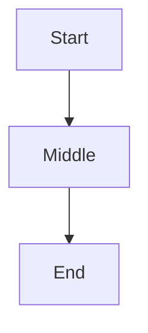

# Rich Features Demo

## Callouts

> [!NOTE]
> This is a note callout.

> [!WARNING]
> Watch out for this.

## Code

```python
def greet(name):
    return f"hello, {name}"
```

## Diagram



## Table

| Feature | Status |
|---|---|
| Parsing | done |
| Rendering | wip |
| Tests | todo |
