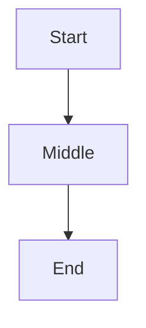

# Rich Features Demo

## Callouts

> [!NOTE]
> This is a note callout.

> [!WARNING]
> Watch out for this.

## Code

```python
def greet(name):
    return f"hello, {name}"
```

## Diagram



## Table

| Feature | Status |
|---|---|
| Parsing | done |
| Rendering | wip |
| Tests | todo |

## Tree

```tree
project/
├── src/
│   ├── main.py
│   └── utils.py
├── tests/
│   └── test_main.py
└── README.md
```

## Diff

```diff
@@ -3,4 +3,5 @@
 def greet(name):
-    return f"hi, {name}"
+    return f"hello, {name}"
+    # polite version
```

## Endpoint

```endpoint
GET /users
description: list users
params: id (uuid, optional), include (string, optional)
response: 200 {users: []}

POST /users
description: create a user
body: {name: string, email: string}
response: 201 {id: uuid}
```

## Env

```env
# database
DATABASE_URL=postgres://localhost/app
# secrets
API_SECRET=hunter2
JWT_SIGNING_KEY=aabbccdd
# public knobs
LOG_LEVEL=info
PORT=8080
```

## Risk

```risk
- title: SQL injection
  likelihood: med
  impact: high
  mitigation: parameterized queries everywhere
- title: Token leak in logs
  likelihood: low
  impact: high
  mitigation: redact in log formatter
- title: Cache staleness
  likelihood: high
  impact: low
  mitigation: TTL + manual purge
- title: UX regression
  likelihood: med
  impact: med
  mitigation: visual regression tests
```

## Deps

```deps
ecosystem: npm
react@18.3.0
@radix-ui/react-tooltip@1.0.7
ecosystem: pypi
fastapi@0.110
sqlalchemy@2.0
ecosystem: crates
serde@1.0
```
