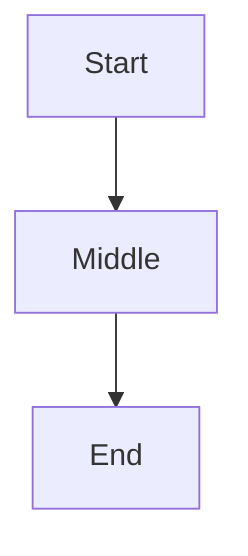

# Rich Features Demo

## Callouts

> [!NOTE]
> This is a note callout.

> [!WARNING]
> Watch out for this.

## Code

```python
def greet(name):
    return f"hello, {name}"
```

## Diagram



## Table

| Feature | Status |
|---|---|
| Parsing | done |
| Rendering | wip |
| Tests | todo |

## Tree

```tree
project/
├── src/
│   ├── main.py
│   └── utils.py
├── tests/
│   └── test_main.py
└── README.md
```

## Diff

```diff
@@ -3,4 +3,5 @@
 def greet(name):
-    return f"hi, {name}"
+    return f"hello, {name}"
+    # polite version
```
